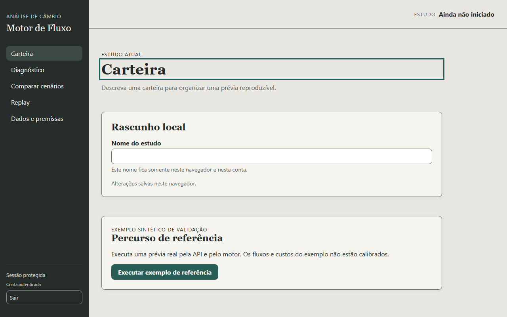
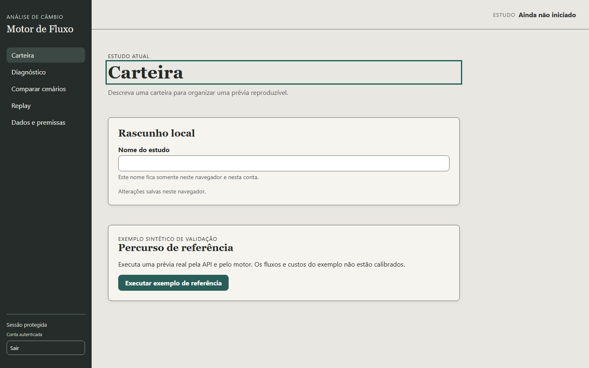
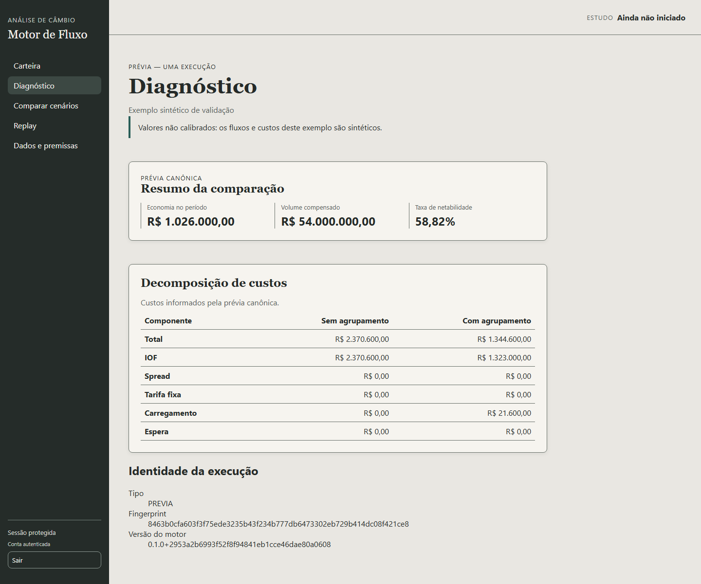
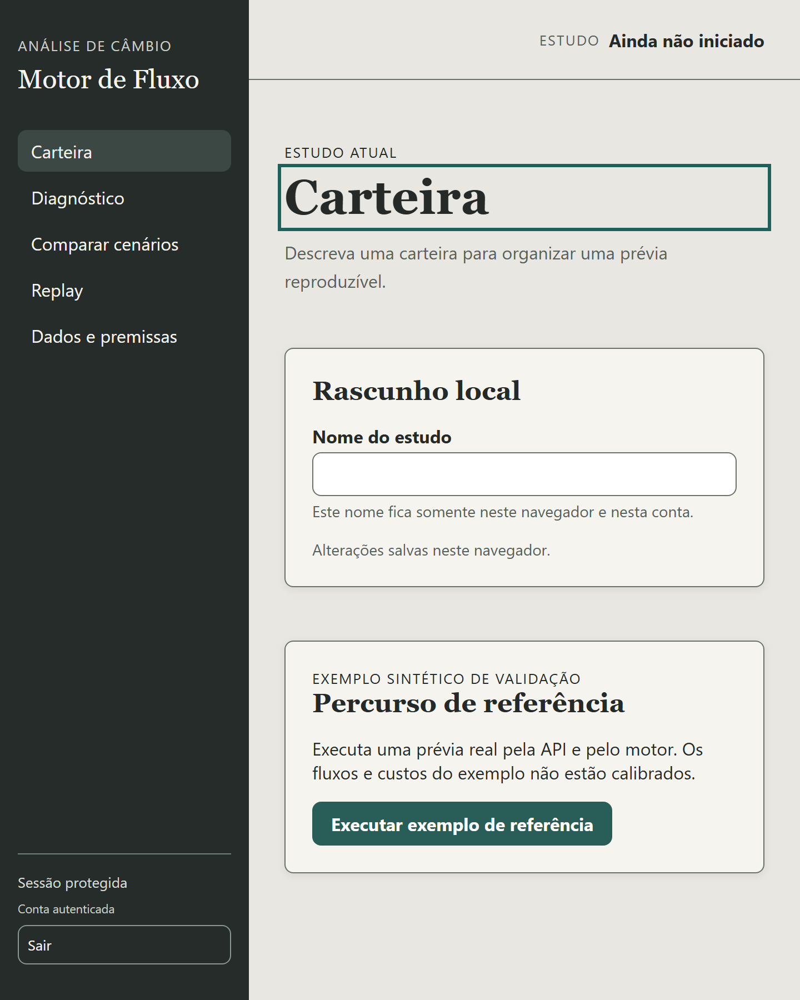
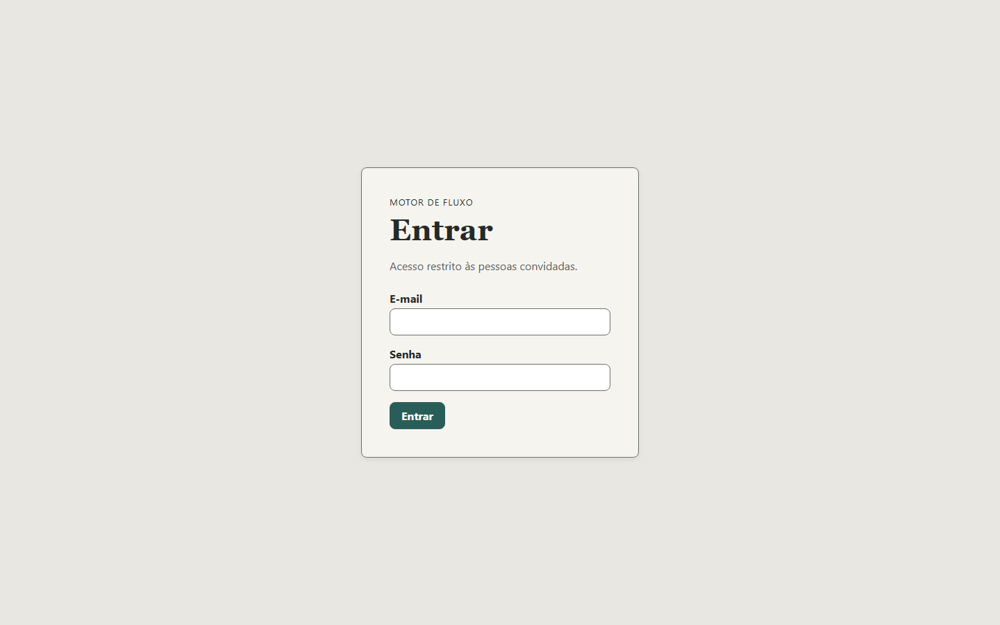
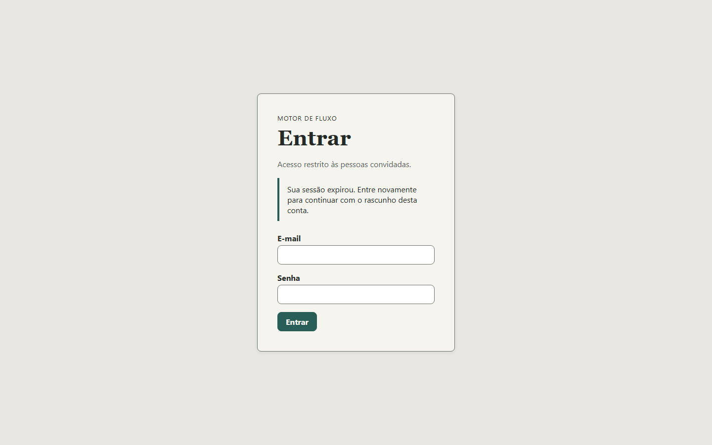

# MOT-22 — aceitação, CI e handoff da etapa 1

## Estado e base

A execução ocorre na branch `codex/mot22-aceitacao-ci`, criada da `origin/main`
`2953a2b6993f52f8f94841eb1cce46dae80a0608`, merge do PR #33. A entrega foi
publicada e integrada pelo PR #34, cuja primeira entrega foi o commit
`a7ca867f57083b89b430c96be1ea823397e46b26`. O primeiro workflow `acceptance`
passou em 1m52s; o gate final preservou o nome protegido `pytest` e manteve a mesma
matriz. O merge ocorreu somente depois da autorização separada.

## Gate automatizado

O workflow de PR usa Python 3.11 e Node 24 com os locks do repositório. Ele:

1. instala o pacote e as dependências travadas;
2. regenera OpenAPI, tipos e validadores e falha se houver diff;
3. roda Pytest normal e sob `python -O`, Ruff e mypy da camada `servidor`;
4. constrói uma wheel, reinstala-a e importa `motor`/`servidor` fora do checkout;
5. roda typecheck, ESLint, Vitest e build de produção;
6. procura formatos de segredo em arquivos rastreados e no bundle de produção;
7. instala Chromium e percorre o build servido pelo FastAPI na mesma origem;
8. mede cinco POSTs reais da referência e exige p95 de até 5 segundos.

O mypy trata `motor` como dependência pública e não segue seus módulos internos.
Isso preserva a fronteira da MOT-22: os 31 apontamentos preexistentes em
`motor/analise` não são ocultados por alterações no motor, e os 23 módulos do
servidor continuam verificados.

## Matriz consolidada

| Área | Evidência |
|---|---|
| Entrada e limites | DTO/HTTP recusam number, não finitos, expoente, bool em inteiro, duplicidade, extras, prazo inválido, PTAX zero, corpo acima de 1 MiB, 1.001 ordens, resposta acima de 8 MiB e concorrência com 429. |
| Tempo e identidade | LEGADO/NATURAL, aquecimento, coorte e liquidação posterior estão cobertos; valor, cliente, finalidade, eFX, prazo, janela, custo, política temporal e SHA mudam o hash, enquanto escala decimal, ordem, nome e fonte seguem a separação contratada. |
| Canônico e conservação | Roundtrip, ordem desconhecida, alocação ausente/duplicada, tipo inválido, conservação por ordem/global/coorte, cenário vazio e economia negativa são exercitados sem recalcular economia. |
| JWT e JWKS | Ausência, expiração, futuro, issuer, audience, role, anonimato, UUID, assinatura, `none`, algoritmo diferente, allowlist, rotação, cache, TTL, indisponibilidade e concorrência estão cobertos. |
| Convite e sessão | Callback, tipo inválido, URL limpa, primeira senha, refresh falho, expiração, outra aba, storage bloqueado e troca de conta permanecem cobertos pelos testes da MOT-20 e pelos estados visuais da aceitação. |
| HTTP, cliente e apresentação | API JSON, rotas profundas, assets e traversal; JSON/HTML/versão/decimal inválidos; 401/403/429/503, timeout, retry apenas de GET, resposta tardia, HALF_UP, nulo e grandezas canônicas. |
| Empacotamento | Wheel instalada fora do checkout contém os dois pacotes e os YAMLs; o build de produção é servido pelo FastAPI junto das rotas privadas reais. |

## Navegador e autenticação

O projeto Playwright `local` usa um build exclusivo `e2e`. Somente o verificador de
sessão é controlado; GET, POST, DTOs, adaptador, serialização, estáticos e motor são
reais. O projeto `real-auth` não inicia esse launcher e só executa quando URL,
e-mail e senha existem no ambiente protegido; em PR sem credenciais ele é ignorado,
sem imprimir valores.

O gate manual reutilizou a sessão já autenticada no navegador e a configuração
local ignorada. Carteira → FastAPI → adaptador → motor → Diagnóstico reproduziu
R$ 1.026.000,00, 58,82%, origem sintética e aviso de não calibração. Nenhuma senha,
token, chave ou e-mail foi inserido ou registrado. Cadastro fechado, convite,
primeira senha, F5, logout e isolamento já têm evidência integrada nos registros
da MOT-20 e MOT-21. A recusa de token inválido permanece coberta pela suíte
automatizada; ações administrativas não foram repetidas apenas para produzir nova
captura.

## Evidência visual controlada

As capturas usam somente sessão e identificadores sintéticos do launcher local.













## Medição local

Em Windows, CPython 3.12.14 e execução HTTP em processo pelo `TestClient`, cinco
POSTs completos da referência tiveram p95 conservador igual ao mais lento da
amostra: **11,2 ms**. O maior envelope teve **7.152 bytes**. Esta medição valida
somente o exemplo de referência; não é benchmark da grade nem promessa para
carteiras futuras.

Na rodada completa local passaram 647 testes Python (2 ignorados) tanto no modo
normal quanto sob `python -O`, 89 testes Vitest, Ruff, mypy, typecheck, ESLint,
build de produção e três testes Playwright locais. O projeto Playwright real foi
confirmado como opt-in e ficou ignorado sem credenciais na linha de comando; o gate
equivalente com a sessão Supabase já aberta foi executado manualmente no navegador.
O único aviso de build é o chunk principal acima de 500 kB, já existente na base e
não bloqueante para esta etapa.

## Contratos para a etapa 2

- Fonte HTTP: `contracts/openapi.json`; tipos e runtime em
  `web/src/api/generated.ts`, `schemas.json` e `validators.ts`.
- Rotas: `GET /api/v1/health`, `GET /api/v1/session`,
  `GET /api/v1/examples/reference` e `POST /api/v1/previas`.
- Limites: corpo de 1 MiB, até 1.000 ordens, resposta de 8 MiB, uma prévia por
  processo, timeout do cliente em 30 s, uma repetição apenas para GET transitório e
  nenhuma repetição automática de POST.
- Base integrada da etapa 1: `2953a2b`; primeira entrega verificada da MOT-22:
  `a7ca867`, no PR #34.
- Persistência de estudos, IndexedDB/migrações, autoria participante→geração,
  variantes, comparação, replay completo, execução assíncrona e calibração seguem
  pendentes das etapas posteriores.

## Comandos

```powershell
.\.venv\Scripts\python.exe -m servidor.export_openapi
npm --prefix web run generate:api
.\.venv\Scripts\python.exe -m pytest -q
.\.venv\Scripts\python.exe -O -m pytest -q
.\.venv\Scripts\python.exe -m ruff check servidor tests/web_api
.\.venv\Scripts\python.exe -m mypy servidor
npm --prefix web run typecheck
npm --prefix web run lint
npm --prefix web run test:unit
npm --prefix web run build
npm --prefix web run test:e2e
.\.venv\Scripts\python.exe -m tests.web_api.scan_credentials
.\.venv\Scripts\python.exe -m tests.web_api.measure_reference --max-p95-ms 5000
```
