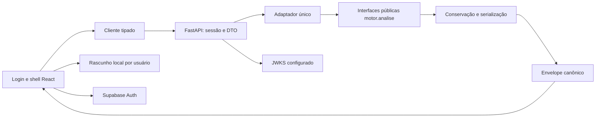

# Etapa 1 — Fundação e contrato com o motor — Implementation Plan

> **For agentic workers:** REQUIRED SUB-SKILL: Use superpowers:executing-plans para executar este plano por tarefas; superpowers:subagent-driven-development é alternativa quando houver decisão explícita de delegação. Steps use checkbox (`- [ ]`) syntax for tracking. Leia as três referências abaixo antes da primeira tarefa. Este documento autoriza planejamento; a implementação começa após aprovação do Gabriel.

**Goal:** entregar login por convite, estrutura desktop navegável e uma prévia de referência validada de ponta a ponta entre navegador, servidor e motor Python.

**Architecture:** React consome uma API FastAPI na mesma origem. O servidor valida sessão e entrada, chama um adaptador único sobre as interfaces públicas do motor e publica um envelope versionado que preserva o resultado canônico. Contratos, identidade de configuração e apresentação são compartilhados; telas não recalculam o motor.

**Tech Stack:** React, TypeScript, Vite, npm, React Router, TanStack Query, Supabase JS; FastAPI, Pydantic, HTTPX, PyJWT com cryptography; Vitest, React Testing Library e Playwright. Python mantém o pacote `motor` existente.

**Spec:** [design aprovado](../specs/2026-09-11-frontend-motor-de-fluxo-design.md), [plano geral e distribuição de modelos](2026-09-11-frontend-plano-geral-execucao-modelos.md), [ambiente e workflow](2026-09-11-frontend-ambiente-e-workflow.md).

**Status:** aprovado por Gabriel nesta conversa. T0–T4 foram integradas na `main` até `64bf303`; T5/MOT-20 está em execução na branch `codex/mot20-auth`. Gabriel provisionou o projeto Supabase com ES256, cadastro fechado e redirects locais. Convite e primeiro acesso reais permanecem ações humanas do gate T5; T6/T7 aguardam sua conclusão.

## 1. Restrições globais

- Nome do produto: **Motor de Fluxo**.
- Navegação: **Carteira**, **Diagnóstico**, **Comparar cenários**, **Replay**, **Dados e premissas**.
- React + TypeScript + Vite; FastAPI + Pydantic; `motor` importado diretamente no servidor; mesma origem na aplicação compilada; contêiner único na publicação da etapa 6.
- npm foi escolhido na ambientação. Novas dependências só são instaladas após aprovação deste plano.
- Login Supabase Auth, e-mail e senha, por convite, permissões iguais para os quatro usuários.
- Estudos locais no navegador; IndexedDB completo é entrega da etapa 2. Não haverá banco de estudos, colaboração, sincronização ou workers persistentes nesta etapa.
- Não copiar cálculo de geração, P0, EDF, custos, netabilidade ou rateio para TypeScript ou para o adaptador.
- Não editar `motor/` nesta etapa. Se uma interface pública não atender ao contrato, registrar a incompatibilidade e resolver no fluxo do motor com seus donos; não importar funções privadas para contornar a fronteira.
- `netting.py` e `custo.py` não se importam; `dominio.py` não importa outros módulos do projeto. Preservar pureza e seed explícita.
- Conservação usa alocações por ordem, nunca soma de pendências dos ciclos. Invariantes de produção usam `raise`, nunca `assert`.
- Cada ordem é posição líquida destinada à pool. Não descontar novamente as métricas experimentais de autonetting.
- Não inferir pareamento entre empresas; não exibir ganhos individuais nesta etapa.
- Nenhuma atualização automática de premissas, interpretação regulatória ou importação de contexto do Obsidian.
- A etapa 1 não executa diagnóstico robusto, sete eixos, comparação, reprecificação, replay, chat ou relatório. Reserva fronteiras necessárias sem implementar esses recursos.
- Mensagens em português, números tabulares, cores sem julgamento de bom/ruim, movimento funcional e respeito a movimento reduzido.
- Mudanças destinadas ao GitHub exigem issue confirmada, diário no mesmo commit e convenção `tipo: descrição (MOT-N)`. Não inventar identificador.

## 2. Evidência e base de trabalho

### 2.1 Estado observado nesta sessão

| Item | Evidência e consequência |
|---|---|
| Checkout inspecionado | `analise/sensibilidade-custo`, SHA `19f2a7f43778acaefcf9b24ececc6d3d3773d7db`; cinco commits locais à frente do upstream. É base da inspeção e deste documento, não autorização para implementar nessa branch. |
| Design em duas pastas | O arquivo indicado pelo usuário em `plans/` é não rastreado; sua cópia em `specs/` é versionada. Ambos têm SHA-256 `366FD26DF2DE9E6012E531C16A38C87C975116D9BA1B358F9E0932B4EB1646C8`. Este plano referencia a cópia versionada; não remove nem modifica a outra. |
| Motor nesse checkout | `motor/simulacao.py:simular(Cenario) -> Resultado`; resultado legado com ciclos e custos. Não existe API HTTP nem aplicação React. |
| Fechamento funcional | Branch `implementacao/fechamento-funcional-motor`, commit observado `3bc2839`; contém `motor.analise` e contratos canônicos. Foi inspecionado por `git show` do commit, sem usar suas edições locais como contrato. |
| Trabalho concorrente | O worktree de fechamento tem alterações não commitadas, inclusive migração de scripts analíticos. Não tocar nem copiar esses arquivos. |
| Identidade atual | `motor/analise/serializacao.py:_configuracao_manifesto` usa campos do manifesto, que não contém a lista de ordens. Seu hash não identifica sozinho uma carteira customizada. Isso é uma lacuna de uso para a API, não autorização para mudar o motor. |
| Tempo | `ConfiguracaoTemporal(dias_aquecimento, periodo_medicao_dias)` distingue coorte medida de execução completa. O adaptador precisa preservar essa distinção. |
| API existente | Nenhuma: autenticação, DTOs HTTP, distribuição de estáticos e cliente tipado serão construídos. |
| Ferramentas | Node `24.19.0` e npm `11.17.0` confirmados. `py` não está disponível nesta sessão; Python da `.venv` executou fora da restrição inicial da sandbox. Não assumir que o PATH desta sessão corresponde à auditoria anterior. |
| Testes reais | `python -m pytest -q` pela `.venv` falha na coleta de `tests/test_exportar_player.py`, arquivo não rastreado que importa `scripts.exportar_player`, ausente. Com `--ignore=tests/test_exportar_player.py`: **270 passed in 9.36s**. Isso não equivale a suíte integral verde. |
| Serviços externos | Linear cadastrado: MOT-15–MOT-22, com T0 Em andamento e dependências do plano configuradas. Projeto Supabase ainda não existe, conforme Gabriel. |

Lidos antes da proposição: `AGENTS.md`, `docs/MAPA.md`, entrada do topo do Diário, arquitetura, ADRs de custo, EDF e Model B. Nenhuma medição analítica nova é necessária; não refazer a varredura.

### 2.2 Decisão de base

**Recomendação:** executar sobre uma base integrada que contenha o fechamento funcional e as três referências do front-end. O SHA final será registrado na tarefa T0, depois de identificar o estado real da integração. Não é possível fornecer honestamente hoje o SHA de um merge futuro.

**Por quê:** construir um segundo resultado canônico sobre `simular` e migrá-lo na etapa 2 criaria dois contratos justamente onde o plano geral pede um único contrato.

**Custo:** a API depende da disponibilização do fechamento. Planejamento e definição visual podem avançar; o gate de integração real não pode ser substituído por mocks.

**Alternativa viável:** base temporária empilhada sobre o commit de fechamento explicitamente escolhido por Gabriel, com PRs dependentes e registro dos SHAs. Vence se a revisão do fechamento demorar e suas interfaces já estiverem estabilizadas. Não fazer merge/cherry-pick da pilha como efeito colateral deste plano.

**Condição de continuidade:** a base deve expor as assinaturas da seção 5.1. Se uma assinatura mudou, revisar somente a costura afetada, sem reconstruir o planejamento inteiro. Se exigir editar arquivos controlados por outra branch, avisar conforme `AGENTS.md`.

## 3. Entrega concreta e limite da etapa

Ao terminar, um usuário convidado entra, percorre os cinco destinos e, em Carteira, executa **Exemplo de referência**. O navegador obtém uma entrada fixa e identificada, envia essa entrada ao servidor autenticado, e Diagnóstico apresenta apenas o resumo daquela execução: custos sem/com agrupamento, economia e volume que não atravessou a fronteira. Um rótulo permanente informa **Prévia — uma execução**, sem percentis ou linguagem de robustez.

O exemplo usa `motor/cenarios/exemplo_amanda.yaml` já versionado, sem inventar finalidades. Seus nomes não são prova de carteira real: a tela informa **Exemplo sintético de validação**. Na etapa 1 não há formulário completo de carteira, seleção dos cinco mixes, cadastro de participantes, salvar estudo ou promessa de persistência de resultados. Os outros destinos têm estados vazios honestos e navegação funcional, sem métricas fabricadas ou botões que aparentem executar funcionalidades ausentes.

Para testar preservação local antes do editor, Carteira oferece somente um campo **Nome do estudo**, utilizado pelo rascunho de integração. Não é um cadastro completo de estudos. O rascunho sobrevive à expiração, navegação, recarga e saída; fica particionado pelo `sub` do usuário. Na etapa 2 será migrado para o repositório IndexedDB.

### 3.1 Aceitação obrigatória

1. Convite controlado, definição inicial de senha, login, logout e expiração verificados; token recusado pelo servidor quando inválido.
2. Acesso direto e recarga das cinco rotas funcionam no build servido pelo FastAPI.
3. Ação no navegador chega ao adaptador real, retorna resultado canônico e reproduz o cenário de aceitação.
4. DTOs e cliente derivados do OpenAPI, validação real de JSON e testes de incompatibilidade de versão.
5. Dinheiro continua decimal textual sem perda no transporte; formatação é única e testada.
6. Alterar valor, prazo ou ordem muda a identidade de execução; nome do estudo não muda a identidade numérica.
7. Falhas de autenticação, validação, transporte, capacidade e conservação não apagam entradas nem apresentam resultado como bem-sucedido.
8. Testes e revisão de integração documentados; nenhum segredo no Git, bundle ou logs.

## 4. Decisões técnicas de fundação

### 4.1 Um contrato de transporte, separado dos contratos do motor

Pydantic no servidor é a fonte do esquema HTTP. OpenAPI será exportado por comando sem conexão ao Supabase e sem execução do motor; TypeScript é gerado a partir dele. Usar `openapi-typescript` para tipos e Ajv 2020 para validar em runtime o schema de resposta extraído do OpenAPI 3.1, com `coerceTypes: false`, `removeAdditional: false`, `useDefaults: false` e `ajv-formats`. Compilar o validador no build quando necessário para evitar geração dinâmica de código no navegador. Não usar `as Resultado` como validação.

`api_version`, `study_schema_version`, `presentation_version` começam em `1.0.0`. `schema_version` do motor é mantido separado. Envelope incompatível é rejeitado explicitamente; não tentar migração silenciosa. Mudança incompatível exige major nova; acréscimos precisam continuar aceitos pelo cliente suportado ou receber versão nova. A geração deve ser determinística, sem timestamp.

### 4.2 Prévia síncrona limitada; robusto fica separado

Etapa 1 usa `POST /api/v1/previas`, resposta `200` completa. Handler síncrono fora do event loop, com limite explícito de uma execução simultânea por processo, aquisição sem espera e liberação em `finally`. Pedido concorrente recebe `429` e `Retry-After: 1`. Rodar apenas um processo web. Isso é suficiente para o pequeno exemplo e não finge entregar o executor de diagnóstico.

O servidor impõe corpo de até 1 MiB antes de interpretar JSON, no máximo 1.000 ordens, horizonte de até 730 e prazo até 1.095 dias. São limites operacionais iniciais desta API, não limites do domínio nem regras regulatórias. Resposta canônica limitada a 8 MiB; excesso retorna `413 RESULTADO_EXCEDE_LIMITE`, nunca resultado truncado. A API não recebe modo COMPLETO ou parâmetros de marginal.

Cliente cancela espera em 30 s com `AbortController`, sem anunciar que cancelou a computação. O slot do servidor só é liberado quando o cálculo acabar. Não repetir POST automaticamente após timeout. Testar saúde/navegação enquanto a execução ocorre. Se a carga válida ultrapassar o orçamento de prévia, o gate falha: reduzir o limite operacional com evidência ou planejar a execução por processos; não colocar cálculo pesado em `BackgroundTasks`.

### 4.3 Segurança mínima completa

Recomendar projeto Supabase com chave assimétrica **ES256**. Servidor usa JWKS da URL configurada, valida assinatura, algoritmo permitido, `iss`, `aud=authenticated`, `exp`, `sub` UUID e `role=authenticated`; exige `iat`, rejeita `iat` no futuro além de 30 s e valida `nbf` se presente. Não aceitar `alg=none`, algoritmo escolhido pelo token, chave indicada por `jku/x5u`, emissor de outro projeto, `service_role` ou usuários anônimos.

Cache de JWKS em memória por 5 min; timeout HTTP de 5 s; atualizar uma vez diante de `kid` desconhecido, com trava para evitar enxurrada de atualizações. Erro de assinatura/chave conhecida é `401`; indisponibilidade sem chave válida utilizável é `503 AUTH_INDISPONIVEL`, nunca bypass. Chave conhecida pode ser usada apenas dentro do TTL. Essa política precisa de testes de relógio e rotação. Se o projeto escolhido usar HS256 legado, interromper a configuração e adaptar a estratégia com decisão explícita; não colocar o segredo JWT no navegador.

`SUPABASE_ALLOWED_USER_IDS` restringe o servidor aos UUIDs convidados, todos com o mesmo papel. Não usar nome ou e-mail como autorização. Cadastro público e usuários anônimos desabilitados no Supabase. Convites são ação administrativa externa, sem endpoint público de convite e sem chave administrativa no app.

JWT validado localmente pode continuar aceito até expirar, mesmo após logout. Registrar essa semântica e configurar access token de 15 min. Logout remove sessão local e limpa cache de resultados da conta; exclusão imediata do UUID da allowlist e reinício é a revogação emergencial. Não alegar revogação instantânea de access token por logout.

### 4.4 Configuração e dependências

| Local | Variáveis definitivas da etapa 1 |
|---|---|
| `web/.env.example` | `VITE_SUPABASE_URL`, `VITE_SUPABASE_PUBLISHABLE_KEY`; somente configuração pública, sem valores reais |
| `.env.example` | `APP_ENV`, `SUPABASE_URL`, `SUPABASE_JWT_ISSUER`, `SUPABASE_JWT_AUDIENCE`, `SUPABASE_ALLOWED_USER_IDS`, `MOTOR_BUILD_SHA`, `WEB_DIST_DIR` |
| Teste real, ambiente do processo | `E2E_USER_EMAIL`, `E2E_USER_PASSWORD`; não prefixar com VITE e não persistir storage state autenticado no Git |

`APP_ENV` aceita `development|test|production`; `SUPABASE_JWT_ISSUER` deve equivaler a `SUPABASE_URL + /auth/v1`; JWKS é derivado desse emissor. `MOTOR_BUILD_SHA` deve identificar o código empacotado, não vir do request. `WEB_DIST_DIR` aponta para `web/dist` no dev; configuração faltante em produção falha no startup. Não criar `AUTH_DISABLED`. Dependências de autenticação podem ser substituídas somente pela factory de testes em Python.

`OPENAI_API_KEY` e modelo do chat são responsabilidade futura, não obrigatórios nem lidos na etapa 1. `.env.example` já é a exceção permitida pelo `.gitignore`; confirmar arquivos aninhados com `git check-ignore` antes do commit.

Planejar React 19, Router 7 em modo declarativo, TanStack Query 5, Supabase JS 2 e Pydantic 2. Versões patch de Vite, Vitest, Playwright, FastAPI e demais pacotes serão resolvidas **uma vez na T1**, conferindo compatibilidade com Node 24/Python 3.11; gravar versões exatas no `package-lock.json` e no lock Python. Não instalar `latest` em CI. Não acrescentar ECharts, banco, SDK OpenAI ou biblioteca visual completa nesta etapa.

Python: acrescentar extra `web` com FastAPI, Uvicorn, Pydantic, pydantic-settings, HTTPX e `PyJWT[crypto]`; extra `web-dev` com ferramentas de lint/tipos e geração de lock. `requirements/web-dev.lock` será gerado por `pip-tools` em Python 3.11 e testado também no Python local. `pyproject.toml` continua contendo `motor*` e passa a incluir `servidor*`; testar wheel instalada para não depender só do checkout editável.

## 5. Contratos e interfaces

### 5.1 API pública do motor a consumir

Assinaturas observadas no commit `3bc2839`, importadas por `from motor.analise import ...`:

```python
analisar(cenario: Cenario, configuracao: ConfiguracaoAnalise,
         manifesto: ManifestoExecucao,
         configuracao_temporal: ConfiguracaoTemporal | None = None) -> ResultadoCanonico
ConfiguracaoAnalise(modo=ModoAnalise.AGREGADO)
ConfiguracaoTemporal(dias_aquecimento: int, periodo_medicao_dias: int)
criar_manifesto(*, parametros_custo, mixes, arquetipos, horizonte_dias,
                periodo_medicao_dias, janela_dias, seeds, modo_analise,
                custo_calibrado, metodo_percentil, drenagem, avisos=(),
                run_ids_origem=(), relogio, versao_motor, schema_version="1.0.0")
resultado_para_json(resultado: object) -> str
```

`carregar_cenario` é usado somente para ler o exemplo fixo do pacote no startup. Nunca receber caminho de arquivo, YAML arbitrário, nome de módulo ou expressão Python via API. `Cenario`, `Ordem`, `ParametrosCusto` e enums são construídos diretamente a partir dos DTOs validados, sem importar `_validar_ordens`, `_jsonavel` ou outros auxiliares privados.

O endpoint de exemplo e o adaptador usam a mesma tradução canônica. As referências a `motor.analise` são requisito de base, não afirmação de disponibilidade em `19f2a7f`.

### 5.2 Primitivos e validação

`DecimalText` é string decimal ASCII finita, sem expoente, vírgula ou espaços, até 80 caracteres: `^-?(0|[1-9][0-9]*)(\.[0-9]+)?$`. Entradas monetárias devem ser positivas ou não negativas conforme o campo; saída permite economia negativa. Nenhum JSON number é aceito no lugar de dinheiro. Normalização para identidade remove zeros decimais à direita e converte `-0` em `0`, sem `float` ou `Decimal.normalize()` dependente de contexto.

```python
def canon_decimal(texto: str) -> str:
    valor = Decimal(texto)  # DecimalText já validado
    if valor == 0:
        return "0"
    fixo = format(valor, "f")
    return fixo.rstrip("0").rstrip(".") if "." in fixo else fixo
```

IDs de ordem/cliente: string não vazia, sem espaços externos, no máximo 128 caracteres; não alterar caixa ou normalizar Unicode silenciosamente, pois `id` desempata EDF. Nomes de estudo: texto de 1–120 caracteres; fonte: até 200. Inteiros estritos, rejeitando `true`, `1.5` e `"1"`; booleanos estritos. `extra="forbid"` em requests. Regras e erros devem apontar o caminho do campo.

| DTO | Campos e invariantes |
|---|---|
| `OrigemValor` | `tipo: PADRAO_SINTETICO|ESTIMATIVA_USUARIO|DADO_OBSERVADO`, `fonte: str`, `registrado_em_utc: datetime` com fuso; DADO_OBSERVADO reservado e recusado na entrada desta etapa |
| `CampoDecimal` | `valor: DecimalText`, `origem: OrigemValor`; um valor, sem intervalos |
| `OrdemEntrada` | `id`, `cliente_id`, `direcao: OUT|IN`, `valor_brl`, `dia_conhecida`, `dia_limite`, `eh_efx`, `finalidade`. IDs únicos; `0 <= dia_conhecida <= horizonte_dias`; `dia_limite >= dia_conhecida`; prazo até 1.095; valor `0 < v <= 10^12`, no máximo 6 casas decimais |
| `RegraIOF` | `finalidade`, `direcao`, `aliquota: DecimalText` em `[0,1]`; par único; não adicionar regras implícitas |
| `CustoEntrada` | `iof_out`, `iof_in`, `carry_cnr`, `spread_rail_bps`, `custo_fixo_remessa`, `custo_oportunidade_aa`, `ptax`, `iof_por_finalidade`; todos decimais textuais; taxas fracionárias `[0,1]`, spread `[0,10000]`, fixo `[0,10^12]`, PTAX `(0,10^6]`; até 12 casas nas taxas/PTAX; tabela até 100 regras |
| `CenarioEntrada` | `ordens: OrdemEntrada[]`, `janela_dias: int` em `[1,730]`, `horizonte_dias: int` em `[0,730]`, `custo: CustoEntrada`; aceita carteira vazia para preservar a semântica do motor |
| `PeriodoEntrada` | União por `modo`: `LEGADO` sem outros campos; ou `NATURAL` com `dias_aquecimento >= 0`, `periodo_medicao_dias > 0`; soma até 731; últimas entradas estritamente anteriores à soma e contidas no horizonte informado |
| `ProvenienciaEntrada` | Mapa de caminhos JSON Pointer existentes no cenário para `OrigemValor`; exigir origem de todos os valores numéricos, finalidade e booleano eFX. Metadados do estudo/IDs não precisam de origem. Sem caminhos inexistentes |
| `PreviaRequest` | `api_version: "1.0.0"`, `request_id: UUID`, `study_id: UUID`, `scenario_id: UUID`, `scenario_revision: int >= 1`, `cenario`, `periodo`, `proveniencia`; não aceita seed fictícia para ordens explícitas |

Não estabelecer relação entre volume, ticket e frequência de participantes nesta etapa: essa conversão pertence ao editor/gerador da etapa 2. A fundação recebe ordens já explícitas, valida e executa; não faz de conta que um DTO de participante equivale a uma ordem.

### 5.3 Estudo e cenário local

Contrato implementado como tipos e repositório em memória para teste; persistência integral em IndexedDB só na etapa 2:

```typescript
type StudyDocument = {
  study_schema_version: '1.0.0';
  id: string; owner_sub: string; name: string;
  created_at: string; updated_at: string;
  base: ScenarioDocument;
  variants: ScenarioVariant[];
  results: PreviewEnvelope[];
  selected_replay: { execution_id: string; repetition_id: string } | null;
};
type ScenarioDocument = {
  id: string; revision: number;
  input: CenarioEntrada; period: PeriodoEntrada;
  provenance: ProvenienciaEntrada;
};
type ScenarioVariant = {
  id: string; base_id: string; base_revision: number; name: string;
  changes: Array<
    | { kind: 'add_order'; order: OrdemEntrada }
    | { kind: 'remove_order'; order_id: string }
    | { kind: 'replace_order'; order_id: string; order: OrdemEntrada }
  >;
};
interface StudyRepository {
  list(ownerSub: string): Promise<StudyDocument[]>;
  get(ownerSub: string, id: string): Promise<StudyDocument | null>;
  save(ownerSub: string, study: StudyDocument): Promise<void>;
  remove(ownerSub: string, id: string): Promise<void>;
}
```

`CenarioEntrada`, `PeriodoEntrada`, `ProvenienciaEntrada` e `PreviewEnvelope` são aliases dos tipos gerados do servidor; não redeclarar seus campos. `StudyDocument` representa o snapshot técnico executável. A modelagem de carteira/grupos/participantes da etapa 2 adicionará seu documento de autoria separado desse snapshot, com migração de schema explícita; não forçar tela de participante a editar alocações ou ordens manualmente. Variantes são diferenças, não cópias da base. Nesta etapa a lista de variantes fica vazia; apenas validar estrutura, IDs e revisão base, sem executor de comparação.

### 5.4 Identidade numérica e proveniência

O servidor constrói uma estrutura normalizada contendo:

```text
api_version + MOTOR_BUILD_SHA + schema_version_motor
+ cenario (todas as ordens completas, custo, janela, horizonte)
+ periodo (modo e campos temporais)
+ analise = {tipo: PREVIA, modo_motor: AGREGADO, origem: ORDENS_EXPLICITAS}
```

Ordenar ordens por `id` e regras IOF por `(finalidade,direcao)`; normalizar todos os decimais; JSON UTF-8, `sort_keys=True`, separadores compactos, `ensure_ascii=False`, `allow_nan=False`; SHA-256 gera `execution_fingerprint`. Identidade inclui IDs, cliente, eFX, finalidade e ambas as datas relativas. Não inclui nome, horário, IDs de request/estudo/cenário ou proveniência. Preservar o hash original do manifesto como `manifesto.hash_configuracao`; não sobrescrevê-lo com significado novo.

Separadamente, `provenance_fingerprint` usa SHA-256 do mapa de proveniência canônico completo. Mudança de fonte não altera números, mas muda a identidade da evidência. `scenario_revision` e `request_id` impedem que resposta tardia ocupe o lugar de uma configuração mais recente. A etapa 2 implementará a política completa de desatualização/reprecificação.

`execution_id` é UUID atribuído pelo servidor a cada tentativa bem-sucedida, distinto de `request_id`, fingerprint e `manifesto.run_id`. Repetir configuração produz os mesmos valores e fingerprint, mas IDs e timestamp podem mudar. Testes de reprodução excluem somente esses metadados voláteis.

### 5.5 Envelope de saída

```text
PreviewEnvelope
  api_version = 1.0.0
  presentation_version = 1.0.0
  execution_id, request_id, study_id, scenario_id, scenario_revision
  execution_fingerprint, provenance_fingerprint, motor_build_sha
  kind = PREVIA
  statistics = {kind: SINGLE_EXECUTION, count: 1, seed: null,
                repetition_id: execution_id, percentile_method: null}
  input_snapshot = {cenario, periodo, proveniencia}
  result = ResultadoCanonicoDTO (espelho tipado do JSON público em AGREGADO)
  presentation = {currency: BRL, locale: pt-BR, rounding: HALF_UP,
                  money_digits: 2, fraction_percent_digits: 2}
```

Não inventar seed: o exemplo tem ordens explícitas e nenhuma geração aleatória. O `manifesto.seeds` é tupla vazia, `mixes/arquetipos` vazios, `modo_analise=AGREGADO`, `custo_calibrado=False`, `metodo_percentil="NAO_APLICAVEL"`. `versao_motor` usa versão instalada acrescida do SHA da build; não confiar apenas no `0.1.0` do pacote. `drenagem` é `LEGADO` para o exemplo ou `NATURAL` quando houver configuração temporal. Resultado agregado preserva `ids_ordens_medidas` e `execucao_completa`.

Definir DTOs de saída explícitos em `servidor/contracts/output.py`. A reflexão direta das dataclasses não basta: `ParametrosCusto.iof_por_finalidade` é um Mapping com chaves tupla no Python, mas o serializador público o transforma em lista de regras no JSON. Copiar esse **formato de transporte** é necessário; copiar cálculos é proibido. O serializador público continua produzindo o resultado, e os DTOs apenas o validam/documentam.

| DTO de saída | Campos exatos |
|---|---|
| `CustosDTO` | `iof`, `carry`, `spread`, `espera`, `fixo`, `total`, todos DecimalSaida |
| `AlocacaoDTO` | `ordem_id: str`, `dia: int`, `valor_brl: DecimalSaida`, `tipo: CASADO|REMETIDO` |
| `CicloDTO` | `dia`, `alocacoes: list[AlocacaoDTO]`, `bruto_out`, `bruto_in`, `casado`, `residuo` (DecimalSaida), `direcao_residuo: OUT|IN` |
| `ResultadoLegadoDTO` | `ciclos: list[CicloDTO]`, `baseline: CustosDTO`, `netado: CustosDTO`, `economia`, `taxa_netabilidade` (DecimalSaida) |
| `AgregadoDTO` | `execucao_completa: ResultadoLegadoDTO`, `ids_ordens_medidas: list[str]`, `volume_bruto_periodo_brl`, `volume_casado_periodo_brl`, `volume_remetido_periodo_brl`, `economia_periodo_brl`, `taxa_netabilidade_periodo` (DecimalSaida), `baseline_periodo: CustosDTO`, `netado_periodo: CustosDTO` |
| `ManifestoDTO` | `run_id`, `schema_version`, `versao_motor`, `criado_em_utc`, `hash_configuracao` (str); `run_ids_origem`, `mixes`, `arquetipos`, `avisos` (list[str]); `parametros_custo: CustoEntrada`; `horizonte_dias`, `periodo_medicao_dias`, `janela_dias` (int); `seeds: list[int]`; `modo_analise: AGREGADO`; `custo_calibrado: bool`; `metodo_percentil`, `drenagem` (str) |
| `DiagnosticosExperimentaisDTO` | `limite_intra_cliente_brl`, `volume_casado_incremental_brl`, `taxa_netabilidade_incremental`, todos obrigatórios e `None` no modo contratado |
| `ResultadoCanonicoDTO` | `manifesto: ManifestoDTO`, `agregado: AgregadoDTO`, `clientes`, `ledger_eventos`, `contribuicoes_marginais` (listas obrigatoriamente vazias, schema com maxItems=0); `diagnosticos_experimentais: DiagnosticosExperimentaisDTO`, `avisos: list[str]` |

`DecimalSaida` aceita somente string no JSON, valida a gramática DecimalText e converte para `Decimal` dentro do DTO Python; serializer Pydantic retorna `format(valor, "f")`, sem quantização. Gerar schema em modo de serialização com tipo string e pattern explícitos. Assim os testes Python usam Decimal e o cliente recebe strings. Definir o validador por `BeforeValidator` e serializer por `PlainSerializer`, com `WithJsonSchema` de string na entrada e saída. Não aplicar aos decimais de resultado os limites de casas/volume dos inputs. DTO de saída rejeita campo extra para detectar alteração do contrato do motor. Teste compara `json.loads(resultado_para_json(resultado))` ao dump JSON do DTO, incluindo representação decimal e regra IOF em lista. Nenhum `dict[str, Any]` no resultado público.

### 5.6 Endpoints e erros

| Método/rota | Sessão | Comportamento |
|---|---|---|
| `GET /api/v1/health` | pública | `{status: "ok"}`; sem SHA, configuração ou dados de usuário |
| `GET /api/v1/session` | obrigatória | `{user_id: UUID}` confirmado no servidor; não devolve token |
| `GET /api/v1/examples/reference` | obrigatória | `{cenario, periodo: {modo: LEGADO}, proveniencia}` traduzidos do YAML fixo; sem IDs voláteis |
| `POST /api/v1/previas` | obrigatória | Request da seção 5.2; `200 PreviewEnvelope` após validações |

Erro uniforme: `{error: {code, message, request_id, fields: [{path, code, message}]}}`. `request_id` do erro é um ID de rastreamento gerado se não houver UUID válido. Nunca incluir token, corpo inteiro de entrada ou stack trace.

`400 JSON_INVALIDO`; `401 SESSAO_INVALIDA` + `WWW-Authenticate: Bearer`; `403 ACESSO_NAO_PERMITIDO`; `404 RECURSO_NAO_ENCONTRADO`; `409 VERSAO_INCOMPATIVEL`; `413 LIMITE_EXCEDIDO|RESULTADO_EXCEDE_LIMITE`; `422 ENTRADA_INVALIDA`; `429 CAPACIDADE_OCUPADA`; `500 RESULTADO_INVALIDO|ERRO_INTERNO`; `503 AUTH_INDISPONIVEL`. Sanitizar erros padrão do Pydantic, removendo `input` e contexto sensível. Depois de interpretar JSON e antes da validação integral, versão presente e diferente da suportada gera 409; versão ausente gera 422. Isso evita que Literal produza 422 para uma versão incompatível. Autenticar antes de despachar qualquer cálculo. Rotas de API inexistentes sempre retornam JSON 404, nunca o HTML da SPA.

Respostas privadas e erros de sessão usam `Cache-Control: no-store`. Logs da aplicação registram somente método, pathname sem query, status, duração e request_id. Desabilitar access log padrão do Uvicorn para que o callback de convite não registre token_hash; o middleware sanitizado assume o registro. Não usar `dangerouslySetInnerHTML` para nomes, fontes ou mensagens recebidas.

### 5.7 Portão de publicação analítica

`validar_publicacao(cenario_executado, resultado, json_resultado) -> None` é guarda do adaptador, não recálculo do motor:

- todo decimal é finito; valores de ordem/alocação são positivos;
- toda alocação referencia ordem conhecida, possui tipo válido e dia dentro da execução;
- soma exata por ordem das alocações é o valor original; implementar soma independente de contexto com `fractions.Fraction(Decimal(...))`;
- soma global de CASADO + REMETIDO é o volume das ordens da execução;
- IDs medidos são únicos/subconjunto da execução e coincidem com a coorte solicitada;
- volumes publicados de período correspondem às alocações dos IDs medidos, sem misturar aquecimento e liquidação;
- taxa de netabilidade em `[0,1]`, zero para volume zero; testar a relação com os volumes usando a mesma precisão Decimal do resultado, sem arredondar valores monetários para centavos;
- identidade solicitada/executada, modo, período e SHA coincidem;
- desserializar o JSON público; repetir conservação usando decimais lidos das strings; comparar valores e IDs antes/depois, inclusive decomposição de custos;
- esquema de resposta passa e não contém tipos extras de análise, percentis inventados ou benefícios individuais.

Falha causa `500 RESULTADO_INVALIDO`; nenhum payload parcial é publicado. Testar corrompendo uma alocação após simular, o JSON após serializar e o fingerprint após normalizar. Não ajustar alocações para fazer soma fechar.

### 5.8 Unidades e apresentação

Dinheiro da API é BRL. Referência USD serve ao teste de aceitação, não a uma conversão implícita de tela. Frações chegam entre 0 e 1; `0.588235...` vira `58,82%`. Spread já está em bps. Bps derivados serão calculados no servidor quando contratados; esta etapa não cria uma nova métrica no navegador.

Implementar `formatMoney(DecimalText): string`, `formatFraction(DecimalText): string`, `formatBps(DecimalText): string` e `formatDays(number): string`. Usar aritmética decimal apenas para **formatação**, com `decimal.js`, `ROUND_HALF_UP`; não passar grandes valores por `Number`. Separadores `pt-BR`, duas casas para BRL, percentual e bps, dias inteiros. Zero negativo aparece como zero; `null` aparece como `Não disponível`, sem virar zero. Valores detalhados não usam `k`/`mi` nesta etapa.

Exemplos de contrato: `"1234.565" -> "R$ 1.234,57"`, `"-0.004" -> "R$ 0,00"`, `"0.5882352941176471" -> "58,82%"`, `"25" -> "25,00 bps"`. Usar espaço não separável entre moeda e número e normalizar somente espaço em testes de renderização. Não alterar dado canônico após formatar.

## 6. Direção visual realizável

Implementar composição editorial em desktop: navegação vertical de 224 px em carvão; cabeçalho com nome do estudo e sessão; área de conteúdo com largura máxima de 1.200 px e margens de 32 px. Login em superfície mineral com formulário de até 400 px. Conteúdo analítico é uma faixa de comparação e uma tabela curta de decomposição, sem grade de cartões iguais.

Tokens iniciais propostos para aprovação junto deste plano:

```css
:root {
  --canvas: #e9e7e2; --surface: #f6f4ef; --surface-alt: #dfddd7;
  --ink: #252a28; --muted: #56615a; --nav: #252c29;
  --on-nav: #f4f3ee; --accent: #295e58; --border: #858b84;
  --error: #8a3631; --focus: #1d625a;
  --font-body: 'Segoe UI', system-ui, sans-serif;
  --font-heading: Georgia, 'Times New Roman', serif;
  --space-1: 4px; --space-2: 8px; --space-3: 12px;
  --space-4: 16px; --space-6: 24px; --space-8: 32px;
  --radius: 8px; --shadow: 0 2px 8px rgb(25 35 30 / 8%);
  --duration: 120ms;
}
```

Tipografia: corpo 15/24 px, rótulo 13/18, título 32/38, valor principal 30/36 com `font-variant-numeric: tabular-nums`. Validar contraste de texto normal ≥4,5:1, texto grande e controles/foco ≥3:1; ajustar token se a combinação real não passar. Não assumir conformidade apenas por definir as cores.

Componentes: Button, TextField com label/erro, InlineNotice, EmptyState, DefinitionTooltip acessível por foco, ComparisonSummary e CostTable. HTML nativo primeiro. `aria-busy` e texto de progresso para execução; `role=alert` só em erro acionável. Título principal único, skip link, foco após navegação, `aria-current`, alvo de interação de pelo menos 32 px.

Aceitar desktop em 1.280×800 e 1.440×900; testar zoom 200% com conteúdo alcançável, sem controles cortados. Não construir layout móvel completo. Replay mantém token escuro reservado, mas sua cena não é desenhada agora. ECharts e exemplos de distribuição ficam na etapa 3; a fundação demonstra tabela e comparação com números reais da prévia.



## 7. Mapa de arquivos e responsabilidades

Todos os caminhos abaixo são relativos à raiz do repositório no worktree de execução. Criar apenas quando a tarefa correspondente começar.

| Arquivos | Responsabilidade |
|---|---|
| `servidor/__init__.py`, `app.py`, `config.py`, `errors.py`, `static.py` | Factory, configuração, erros HTTP e SPA; nenhum cálculo |
| `servidor/contracts/primitives.py`, `input.py`, `output.py`, `preview.py` e `__init__.py` | DTOs, schema e envelope |
| `servidor/identity.py` | Normalização e fingerprints |
| `servidor/auth.py` | Verificação JWKS e autorização por UUID |
| `servidor/motor_adapter.py`, `publication.py` | Construção do cenário, chamada pública, validação de publicação |
| `servidor/routes/session.py`, `examples.py`, `preview.py` e `__init__.py` | Endpoints; slot de prévia é recurso da app, sem estado global do motor |
| `servidor/export_openapi.py` | Exportação determinística do contrato, sem segredos/rede |
| `contracts/openapi.json`, `contracts/fixtures/reference-request.json`, `reference-result.json` | Artefatos gerados e exemplos reais reproduzíveis, sem autenticação |
| `web/package.json`, `package-lock.json`, `index.html`, `vite.config.ts`, `tsconfig.json`, `tsconfig.app.json`, `tsconfig.node.json`, `eslint.config.js` | Bootstrap e scripts |
| `web/src/main.tsx`, `app/router.tsx`, `app/providers.tsx`, `app/AppShell.tsx` | Composição e rotas |
| `web/src/api/generated.ts`, `schemas.json`, `validators.ts`, `client.ts`, `errors.ts` | Tipos, validação runtime e transporte |
| `web/scripts/generate-api.mjs` | Geração/referências locais do OpenAPI e schemas de runtime |
| `web/src/auth/supabase.ts`, `AuthProvider.tsx`, `LoginPage.tsx`, `AuthCallbackPage.tsx`, `SetPasswordPage.tsx`, `RequireSession.tsx` | Sessão, convite e definição de senha |
| `web/src/study/types.ts`, `repository.ts`, `memoryRepository.ts`, `draftRecovery.ts` | Snapshot local e isolamento; não IndexedDB completo |
| `web/src/pages/PortfolioPage.tsx`, `PreviewPage.tsx`, `EmptyDestination.tsx` | Referência integrada e destinos sem recurso implementado |
| `web/src/ui/Button.tsx`, `TextField.tsx`, `InlineNotice.tsx`, `EmptyState.tsx`, `DefinitionTooltip.tsx`, `ComparisonSummary.tsx`, `CostTable.tsx` | Primitivos e apresentação reutilizável |
| `web/src/presentation/format.ts`, `labels.ts`, `styles/tokens.css`, `styles/global.css` | Unidades, linguagem e sistema visual |
| `web/src/test/setup.ts`, `web/vitest.config.ts`, `web/playwright.config.ts` | Infra de testes |
| `tests/web_api/conftest.py`, `test_contracts.py`, `test_identity.py`, `test_adapter.py`, `test_publication.py`, `test_auth.py`, `test_http.py`, `test_static.py` | Testes de servidor |
| Testes `.test.ts`/`.test.tsx` junto a `api`, `auth`, `study`, `presentation`, `pages` | Estados e contratos da interface |
| `web/e2e/foundation.spec.ts`, `web/e2e/real-auth.spec.ts` | Integração local controlada e Supabase real |
| `tests/web_api/run_e2e.py` | Launcher exclusivamente de teste com servidor/verificador controlados, sem variável de bypass na app |
| `requirements/web-dev.lock`, `.env.example`, `web/.env.example`, `.gitignore`, `pyproject.toml` | Dependências, pacote e nomes de configuração |
| `.github/workflows/test.yml`, `docs/frontend/etapa-1-operacao.md`, `docs/DIARIO-DE-MUDANCAS.md` | CI, execução/handoff e registro |

Não editar `.codex/environments/environment.toml` manualmente. Novas ações na interface Codex são opcionais depois dos comandos oficiais funcionarem, conforme documento de ambiente.

## 8. Execução subdividida

Cada T é uma unidade revisável. Passos marcados são ações para execução, não alegações de trabalho já feito. Ciclos de teste começam vermelhos por comportamento ausente, passam com implementação mínima e são seguidos por inspeção do diff. Não fabricar testes para simples cópia de token CSS.

Dependências: `T0 → T1 → T2 → T3`; `T1 → T4`; `T3 + T4 → T5 → T6 → T7`. T4 pode avançar após T1 sem esperar servidor, mas não há necessidade de delegação simultânea. Nenhum executor muda contrato unilateralmente para resolver um teste.

### T0 — Confirmar base e liberar pré-requisitos

**Responsável:** Sol, Medium. **Entrega:** registro de execução em `docs/frontend/etapa-1-operacao.md`. Não muda código.

- [x] Ler regras, três referências e este plano; registrar a aprovação e cadastrar T0–T7 como MOT-15–MOT-22 no Linear autorizado por Gabriel.
- [x] Executar os comandos de inventário e registrar branch/SHA de inspeção, worktrees existentes e dependências de PR.
- [x] Escolher com Gabriel a base integrada ou a alternativa empilhada da seção 2.2: aguardar a base integrada após o fechamento funcional.
- [x] Depois da integração, registrar o SHA exato e confirmar os exports da seção 5.1 por inspeção da base escolhida.
- [x] Criar worktree/branch isolada pelo fluxo `using-git-worktrees` e ferramentas nativas disponíveis. Não criar os seis worktrees futuros antecipadamente.
- [x] Rodar baseline na base escolhida. O teste não rastreado deste checkout não foi copiado para o novo worktree.
- [ ] Registrar responsável humano pelo projeto Supabase, cadastro fechado, UUIDs permitidos, redirect URLs e conta de teste. Provisionamento pode ocorrer enquanto T1–T4 avançam; impede concluir T5/T7 real.

```powershell
git status --short --branch
git rev-parse HEAD
git worktree list
git log -5 --oneline
git ls-tree -r --name-only HEAD motor/analise
.\.venv\Scripts\python.exe -m pytest -q
```

**Gate:** base exata anotada e contratos disponíveis. Falha de suíte existente é registrada/encaminhada, não consertada como ampliação de escopo. Se Python/venv não existir, recriar no worktree segundo ambiente aprovado; não copiar a `.venv`.

### T1 — Contratos, identidade e contrato de apresentação

**Responsável:** Astra, Medium. **Arquivos:** DTOs, `identity.py`, exportação OpenAPI, fixtures, tipos locais de estudo; `pyproject.toml`, lock Python, bootstrap mínimo `web/package.json` e ferramentas de geração. **Testes:** `test_contracts.py`, `test_identity.py`, `format.test.ts`, `memoryRepository.test.ts`.

**Consome:** contratos públicos da seção 5.1. **Produz:** `PreviaRequest`, `PreviewEnvelope`, `normalizar_execucao(request, build_sha) -> dict`, `execution_fingerprint(request, build_sha) -> str`, `provenance_fingerprint(proveniencia) -> str`, `StudyRepository` e formatadores.

- [x] Resolver e travar dependências do servidor e ferramentas de contrato; registrar versões e compatibilidade Python 3.11/Node 24. Gerar o lock, instalar por ele; não mudar dependências centrais do motor sem necessidade demonstrada.
- [x] Criar fixtures lendo o YAML de referência; origem sintética para seus valores. `reference-request.json` tem UUIDs fixos de teste e revisão 1. Não escrever números esperados manualmente no código de aplicação.
- [x] Escrever os testes abaixo e casos parametrizados da seção 9. Rodar primeiro para falha por módulo/comportamento ausente.

```python
def test_valor_numerico_json_nao_e_dinheiro(reference_payload):
    reference_payload["cenario"]["ordens"][0]["valor_brl"] = 10800000.0
    with pytest.raises(ValidationError):
        PreviaRequest.model_validate(reference_payload)

def test_hash_identifica_ordem(reference_request):
    a = reference_request
    b = a.model_copy(deep=True)
    b.cenario.ordens[0].valor_brl = "10800001.00"
    assert execution_fingerprint(a, "a" * 40) != execution_fingerprint(b, "a" * 40)

def test_hash_normaliza_representacao(reference_request):
    a = reference_request
    b = a.model_copy(deep=True)
    b.cenario.ordens[0].valor_brl = "10800000.000"
    b.cenario.ordens.reverse()
    assert execution_fingerprint(a, "a" * 40) == execution_fingerprint(b, "a" * 40)
```

- [x] Implementar DTOs com validação estrita, normalização e contratos locais. A validação de conta em `save/get/remove` verifica `owner_sub`; não basta filtrar lista.
- [x] Criar factory de aplicação que permita gerar schema sem carregar settings reais; exportar `contracts/openapi.json` com schemas estáveis.
- [x] Gerar TS e schemas runtime; demonstrar o payload real aceito e payload com decimal number recusado. Estabilizar o formato antes de UI/API funcional.
- [x] Implementar formatação e seus testes. Exemplo:

```typescript
it('preserva precisão e explicita unidade', () => {
  expect(formatMoney('1234.565')).toBe('R$\u00a01.234,57');
  expect(formatFraction('0.5882352941176471')).toBe('58,82%');
  expect(formatMoney('-0.004')).toBe('R$\u00a00,00');
});
```

- [x] Rodar `python -m pytest tests/web_api/test_contracts.py tests/web_api/test_identity.py -q` e os testes JS focalizados. Regerar contrato duas vezes; diff vazio na segunda.
- [x] Revisar coerência de tipos, schema e semântica de tempo/hash. Registrar decisões na documentação operacional e atualizar Diário no commit real associado à issue.

**Gate:** requisição inválida é recusada por HTTP/schema, não apenas por formulário; mudança de ordem afeta identidade; decimais sobrevivem transporte; nenhum contrato depende de atributo privado do motor.

### T2 — Adaptador único e validação de publicação

**Responsável:** Sol, Medium. **Arquivos:** `motor_adapter.py`, `publication.py`, fixtures de resultado. **Testes:** `test_adapter.py`, `test_publication.py`.

**Consome:** `PreviaRequest` e identidade. **Produz:** `executar_previa(request, *, build_sha, relogio) -> PreviewEnvelope`; `validar_publicacao(...)` da seção 5.7. Relógio injetável para teste. `uuid4` e relógio pertencem ao servidor; nada de I/O dentro do motor.

- [x] Escrever teste de equivalência entre chamada direta a `analisar` e envelope, usando a mesma entrada e relógio fixo.
- [x] Escrever o teste de aceitação em BRL e USD abaixo; verificar que ele falha porque o adaptador não existe.

```python
def test_previa_preserva_aceitacao(reference_request, clock):
    envelope = executar_previa(reference_request, build_sha="a" * 40, relogio=clock)
    a = envelope.result.agregado
    assert a.baseline_periodo.total == Decimal("2370600")
    assert a.netado_periodo.total == Decimal("1344600")
    assert a.economia_periodo_brl == Decimal("1026000")
    assert a.economia_periodo_brl / Decimal("5.40") == Decimal("190000")
    assert a.volume_bruto_periodo_brl == Decimal("91800000")
    assert a.volume_casado_periodo_brl == Decimal("54000000")
    assert a.volume_remetido_periodo_brl == Decimal("37800000")
```

- [x] Construir `ParametrosCusto`, `Ordem`, `Cenario` e manifesto com os campos da seção 5.5; executar `AGREGADO`. `LEGADO` passa `configuracao_temporal=None`; `NATURAL` passa a configuração pública e valida horizonte real após preparação.
- [x] Serializar pelo método público, validar schema, conservar e então montar envelope. Não expor resultados por cliente do fechamento, mesmo que disponíveis em outros modos.
- [x] Acrescentar casos: vazio, uma direção, duas direções balanceadas, cobertura parcial, prazo além da medição, aquecimento e campos corrompidos depois de serializar.
- [x] Gerar fixture `reference-result.json` pelo adaptador com relógio/UUID de teste controlados; testes da UI passam a usar esse resultado, nunca um objeto inventado.
- [x] Rodar testes focalizados e a suíte do motor da base, verificar `git diff -- motor` vazio e registrar commit/Diário.

**Gate:** resultado do adaptador igual ao motor; corrupção bloqueia publicação. Baseline de aceitação é R$ 2.370.600,00 = US$ 439.000,00; netado R$ 1.344.600,00 = US$ 249.000,00; economia R$ 1.026.000,00 = US$ 190.000,00; taxa formatada 58,82%.

### T3 — FastAPI, autenticação de servidor e mesma origem

**Responsável:** Sol, Medium. **Arquivos:** app/config/errors/auth/static e routes; `test_auth.py`, `test_http.py`, `test_static.py`.

**Interfaces:** `create_app(settings: Settings | None = None, verifier: TokenVerifier | None = None) -> FastAPI`; `TokenVerifier.verify(token: str) -> AuthenticatedUser`; `AuthenticatedUser(user_id: UUID)`. Implementação real default é JWKS; testes podem injetar verificador, sem parâmetro controlável pelo request. `require_user` é dependência das três rotas privadas.

- [x] Escrever testes de ausência de Bearer, assinatura errada, token expirado, issuer/audience incorretos, UUID não permitido e serviço JWKS indisponível. Tokens de teste são assinados com chave temporária local; não usar token real em fixture.
- [x] Verificar que o adaptador não foi chamado quando a autenticação falha:

```python
def test_unauthenticated_does_not_run(client, reference_payload, adapter_spy):
    response = client.post('/api/v1/previas', json=reference_payload)
    assert response.status_code == 401
    adapter_spy.assert_not_called()
```

- [x] Implementar Settings, JWKS e allowlist conforme 4.3, health/session e erros sanitizados. Validar configuração inconsistente no startup; não registrar Authorization, URL com token ou corpo.
- [x] Implementar GET do exemplo fixo e POST limitado. Verificar 429 com primeira execução mantida por barreira de teste; verificar liberação depois de sucesso e erro.
- [x] Implementar estáticos só para `assets` e fallback de rotas conhecidas da SPA. Caminhos resolvidos devem permanecer em `WEB_DIST_DIR`; `/api/*`, `/assets/ausente.js` e tentativas `../` não retornam index.html. `index.html` sem cache duradouro; assets com hash podem ter cache imutável.
- [x] Configurar Vite dev proxy de `/api` para `127.0.0.1:8000`; API do cliente é sempre relativa. Sem CORS curinga. Produção não precisa de CORS para navegador da mesma origem.
- [x] Rodar integração via HTTP com JSON efetivo, não só construção Python. Contratos errados geram o código previsto. Confirmar health responde durante cálculo e expirado não executa.
- [x] Rodar testes de pacote instalado e rotas estáticas; registrar verificação e commit/Diário.

**Gate:** nenhuma análise sem sessão válida; não há bypass; rotas profundas e API coexistem. Supabase real ainda é gate separado da T5/T7.

### T4 — Shell, tokens e componentes acessíveis

**Responsável:** Sol define composição; Terra implementa, Medium. **Arquivos:** bootstrap React, app, páginas vazias, UI e CSS; testes de navegação/componentes.

**Interfaces:** `AppShell` recebe rotas filhas; cinco destinos fixos. `ComparisonSummary` e `CostTable` recebem somente campos já validados do envelope e chamam formatadores; não computam economia.

- [x] Completar projeto Vite React TS, `strict: true`, scripts da seção 10 e lock npm. Mantê-lo em `web/`, sem scaffolding na raiz Python.
- [x] Registrar composição da seção 6 na documentação operacional, com screenshot de login e shell em desktop produzido durante implementação.
- [x] Escrever teste de cinco destinos e estado ativo; criar router declarativo. Rotas: `/login`, `/auth/callback`, `/auth/definir-senha`, `/carteira`, `/diagnostico`, `/comparar`, `/replay`, `/premissas`. Raiz redireciona para Carteira depois de resolver sessão.

```typescript
it('identifica o destino atual sem esconder os demais', () => {
  renderShellAt('/carteira');
  expect(screen.getByRole('link', {name: 'Carteira'}))
    .toHaveAttribute('aria-current', 'page');
  expect(screen.getByRole('link', {name: 'Dados e premissas'})).toBeVisible();
});
```

`renderShellAt(path)` é helper de teste com MemoryRouter e provedores controlados, criado no próprio arquivo de teste; não requer sessão Supabase real.

- [x] Implementar tokens, UI nativa e estados vazios. Não usar arquivos `fluxo-cambio.html` ou dashboard externo como fonte.
- [x] Adicionar testes de label/erro/foco, teclado no tooltip e mensagens de execução; nenhum campo fica somente com placeholder.
- [x] Inspecionar desktop e zoom, medir contraste e corrigir tokens reais. Usar screenshot como evidência visual; não aprovar layout só porque compilou.
- [x] Rodar Vitest, typecheck, lint e build; registrar screenshots e commit/Diário.

**Gate:** navegação utilizável e composição aprovada dentro do design; ausência de funcionalidades não é apresentada como análise concluída.

### T5 — Login, convite e preservação de rascunho

**Responsável:** Terra, Medium; Sol revisa autenticação e isolamento. **Arquivos:** `web/src/auth/*`, `study/draftRecovery.ts`, `study/memoryRepository.ts`; testes de sessão/rascunho.

**Interfaces:** `useAuth()` expõe `{status, userId, signIn(email,password), signOut(), getAccessToken()}`. Status: `loading|authenticated|unauthenticated|expired|unavailable`. `DraftRecovery` expõe `load(ownerSub)`, `save(ownerSub, draft)`, `clear(ownerSub)`; draft é `{version:1, owner_sub, study_id, name, updated_at}`. Sem senha/token nesse objeto.

- [ ] Provisionamento humano: criar projeto, desabilitar signup público/anônimo, confirmar ES256, configurar URLs exatas `http://localhost:5173/auth/callback` e a origem local do build, fornecer UUIDs e configuração pública. Não usar wildcard para qualquer domínio.
- [ ] Configurar template de convite/recovery para callback com `token_hash` e `type=invite|recovery`; callback lê os parâmetros em memória, limpa a URL com replace e chama `verifyOtp` do SDK com tipo permitido. Configurar `detectSessionInUrl: false` para esse fluxo explícito, evitando processamento duplicado/aceitação de fragmentos não contratados. Nunca guardar token em log; `Referrer-Policy: no-referrer` na rota. Links expirados mostram erro e retorno ao login, sem loop. Próximo destino é fixo em `/auth/definir-senha`; não aceitar redirect externo enviado pelo link.
- [ ] Definir senha via `updateUser({password})` somente depois de sessão de convite/recovery validada. Criar conta e enviar convite permanecem ações humanas explicitamente autorizadas. Política de senha refletida no UI e validada pelo Supabase, mínimo 12 caracteres, sem truncar espaços silenciosamente.
- [ ] Escrever testes: login válido/inválido, sessão em carregamento, callback inválido, expiração durante rascunho, falha de refresh, troca de usuário e logout em outra aba.
- [ ] Implementar Supabase client singleton, sessão via SDK e inscrição/desinscrição em eventos. Não bloquear callback do evento esperando outra chamada Auth; disparar trabalho assíncrono fora dele.
- [ ] Implementar rascunho mínimo em localStorage por `motor-fluxo:draft:v1:<sub>`, salvamento ao editar nome, leitura/validação antes de restaurar. JSON corrompido não é apagado automaticamente; mostrar falha de recuperação. Erro de quota/storage bloqueado preserva estado em memória e informa que a recuperação após recarga não está disponível.
- [ ] Em `401`, preservar rascunho e resultado recebido em memória, bloquear novos cálculos e pedir login. Após reconectar a mesma conta, restaurar a tela sem repetir POST. Em conta diferente, limpar cache em memória e não mostrar rascunho do usuário anterior. Não guardar senha de login no rascunho.
- [ ] Logout salva draft da conta, limpa Query cache e sessão SDK; falha de rede no signOut não mantém tela autenticada localmente. Sincronizar abas via eventos do SDK/storage, sem transportar tokens em canal próprio.
- [ ] Verificar convite, definição de senha, login e POST autenticado contra Supabase real. Sem projeto/conta, registrar testes locais como locais; não marcar esta tarefa concluída.

Teste mínimo de preservação, implementado com harness Auth e storage controlados:

```typescript
it('expiração não perde o nome e outra conta não o recebe', async () => {
  const h = renderAuthenticatedPortfolio('user-a');
  await h.user.type(screen.getByLabelText('Nome do estudo'), 'Carteira piloto');
  h.expireSession();
  expect(h.loadDraft('user-a')?.name).toBe('Carteira piloto');
  h.loginAs('user-b');
  expect(screen.getByLabelText('Nome do estudo')).toHaveValue('');
});
```

`renderAuthenticatedPortfolio` é helper local de teste que injeta AuthProvider controlado, limpa localStorage por teste e usa `userEvent`; seus métodos `expireSession/loginAs` envolvem atualizações React em `act`.

**Gate:** entrada/saída/convite completos, rascunho preservado e isolamento demonstrado. Teste automatizado não deve enviar convites reais automaticamente.

### T6 — Cliente tipado e percurso real navegador → motor

**Responsável:** Terra, Medium; Sol na integração do resultado. **Arquivos:** `api/client.ts`, erros/validação, `PortfolioPage.tsx`, `PreviewPage.tsx`, providers e testes.

**Interfaces:** `getReferenceExample(signal?) -> Promise<ReferenceExample>`; `runPreview(input: PreviaRequest, signal?) -> Promise<PreviewEnvelope>`; ambas obtêm Bearer no instante da chamada pelo SDK. `ApiError` contém `{status, code, message, fields, requestId}` sem dados secretos.

- [ ] Escrever testes de resposta incompatível, decimal incorreto, 401/403/429/503, timeout e referência trocada. POST nunca tem retry automático.
- [ ] Implementar cliente com validação runtime da resposta antes de cache/render. Rejeitar JSON inválido e resposta HTML da API. Tempo limite usa AbortController e expõe mensagem de espera encerrada, não conclusão de cancelamento do motor.
- [ ] Criar QueryClient por sessão de usuário; queries GET podem repetir uma vez em erro transitório, nunca em 401/403. Mutations `retry: false`; invalidar/cache limpar na troca de conta. Resultado não desaparece por refetch em foco.
- [ ] Ligar **Executar exemplo de referência**: obter fixture da API, criar request UUID/IDs locais, enviar snapshot e manter registro do request atual em provider acima das rotas. Botão bloqueado enquanto ativo; navegação não duplica envio.
- [ ] Verificar `request_id`, `scenario_id` e revisão antes de aplicar resposta. Resposta tardia de outra sessão/estudo é descartada. Guardar envelope imutável; estado local do formulário não pode modificar `input_snapshot` recebido.
- [ ] Renderizar em Diagnóstico a prévia e decomposição vindas do agregado canônico. Não calcular `baseline - netado` em JS: usar `economia_periodo_brl`. Mostrar origem sintética e aviso de não calibração.
- [ ] Demonstrar falha de servidor após preencher nome e durante request: nome preservado, saída anterior identificada, nova execução só por ação do usuário. Não alegar consulta offline de estudo salvo completo antes da etapa 2.
- [ ] Rodar percurso Playwright com API e motor reais; auth controlado no launcher de testes. Fazer o percurso manual/automatizado com Auth real para gate final.

```typescript
test('referência chega ao motor e retorna seus valores', async ({page}) => {
  await page.goto('/carteira'); // sessão provisionada pelo setup de teste
  await page.getByRole('button', {name: 'Executar exemplo de referência'}).click();
  await page.getByRole('link', {name: 'Diagnóstico'}).click();
  await expect(page.getByText('Prévia — uma execução')).toBeVisible();
  await expect(page.getByTestId('economia-brl')).toHaveText('R$\u00a01.026.000,00');
  await expect(page.getByTestId('netabilidade')).toHaveText('58,82%');
});
```

`data-testid` é usado apenas nas grandezas cuja posição pode mudar; navegação e botões usam papéis/nomes acessíveis. O teste acompanha resposta POST para afirmar `kind=PREVIA` e fingerprint presente; não intercepta resultado com mock.

**Gate:** login → referência → POST real → resultado correto → navegação/recarga controladas; falha não é tratada como sucesso.

### T7 — Aceitação, CI e handoff para etapa 2

**Responsável:** Sol, Medium; revisão Astra delimitada a identidade/conservação/autenticação se houver mudança material desses contratos. Terra corrige acabamento. **Arquivos:** CI, E2E, operação e Diário.

- [ ] Criar launcher de testes Python isolado de produção; factory injeta somente verificador de sessão de teste, mantendo DTOs, adaptador, serialização e estáticos reais. O teste real usa app sem overrides e credenciais do ambiente.
- [ ] Configurar CI em PRs, inclusive bases empilhadas autorizadas; workflow atual filtra somente `main`. Testes de motor permanecem em Python 3.11; testes web/API incluem Node 24, instalação travada, typecheck, lint, unitários, build e Playwright Chromium.
- [ ] Regerar OpenAPI/tipos e falhar CI se `git diff --exit-code -- contracts web/src/api/generated.ts web/src/api/schemas.json web/src/api/validators.ts` não estiver vazio. Não atualizar snapshot automaticamente para fazer teste passar.
- [ ] Executar matriz da seção 9, suíte normal e sob `-O`, pacote instalado e teste do build servido pelo FastAPI. `-O` pode avisar sobre asserts de testes; invariantes de produção continuam ativos.
- [ ] Verificar bundle e arquivos adicionados quanto a chaves secretas e credenciais. Supabase publishable key é pública e esperada; não marcar toda ocorrência de “supabase” como vazamento. Nenhum valor service-role ou OpenAI pode aparecer.
- [ ] Inspecionar login, Carteira, Prévia e sessão expirada em 1.280×800/1.440×900 e zoom 200%; anexar screenshots sem dados pessoais/tokens. Não tirar screenshot de callback com token na URL.
- [ ] Registrar tempo da referência em cinco execuções locais e tamanho do envelope, sem transformar isso em benchmark da grade. Meta inicial: p95 das cinco medições até 5 s no ambiente anotado; se falhar, investigar antes do gate, sem inventar garantia para qualquer carteira.
- [ ] Registrar evidências do Supabase real: cadastro fechado, login, callback, token recusado, logout, rascunho e conta diferente. Testes de E2E real não rodam em PR de fork com segredos.
- [ ] Atualizar Diário, revisar PRs na ordem, confirmar CI e entregar guia da etapa 2: schemas, rotas, comandos, limites, SHAs e decisões pendentes. Merge/publicação exigem autorização própria; não são efeitos automáticos da aprovação do plano.

**Gate final:** todos os oito critérios da seção 3.1 demonstrados. Se faltar Supabase, declarar incremento local parcial e impedir avanço anunciado como etapa 1 concluída.

## 9. Matriz de testes e falhas prevenidas

| Área | Casos obrigatórios | Resultado esperado |
|---|---|---|
| Entrada | dinheiro number; NaN/Infinity; expoente; `true` em int; ID duplicado; campo extra; regra IOF repetida; prazo invertido; PTAX zero | 422 antes do motor |
| Limites | body chunked e Content-Length >1 MiB; 1.001 ordens; resposta >8 MiB; execução concorrente | 413/422/429 específicos; sem truncamento e sem simulação duplicada |
| Temporal | dia zero; ordem no último dia medido; aquecimento; prazo após medição; LEGADO e NATURAL | coorte/horizonte distintos, alocações conservadas |
| Identidade | troca de valor, cliente, finalidade, eFX, prazo, janela, política temporal, SHA; reorder; `1.0/1.00`; nome/fonte | alterações numéricas mudam hash; representação/nome não; fonte muda só hash de proveniência |
| Canônico | roundtrip JSON; ordem desconhecida; alocação faltante/duplicada; sinal inválido; economia negativa; cenário vazio | publicação inválida bloqueada; negativo/vazio válidos preservados |
| Referência | motor direto × adaptador × HTTP × UI | mesmos números, centavos apenas na apresentação |
| JWT | ausente, expirado, futuro, emissor/audience/role incorretos, `none`, outro algoritmo, sub fora da allowlist | 401 ou 403, cálculo não chamado |
| JWKS | kid rotacionado, indisponível com/sem cache válido, TTL vencido e chamadas simultâneas | refresh limitado; 503 quando não puder verificar; sem fallback inseguro |
| Convite | link válido, expirado, type inválido, redirect externo, primeira senha, login posterior | sessão somente após validação; URL limpa; erro recuperável |
| Sessão | 401 durante edição, refresh falho, outra aba sai, login com outra conta, storage bloqueado | nome preservado por usuário; cache anterior oculto; falha de persistência comunicada |
| HTTP/SPA | /api inexistente, assets inexistentes, rota profunda, traversal, JSON ruim | API JSON; asset 404; rota de app abre; sem arquivo externo servido |
| Cliente | versão/forma incorreta, response de outro request, timeout, 429/503 | não renderiza como atual; não repete POST; entrada preservada |
| Apresentação | HALF_UP, negativo pequeno, valor grande, fração/percentual, nulo | unidade correta, precisão e rótulos sem ambiguidade |
| Visual/a11y | teclado, labels, foco, contraste, busy/error, zoom e dois desktops | operações alcançáveis sem mouse, informação não depende só da cor |
| Empacotamento | wheel instalada, assets compilados, import do motor e exportação schema sem rede | execução fora do checkout editável, sem dependência de segredo na geração |

Não fixar uma contagem de testes como meta. Cobrir os comportamentos e riscos, reutilizando fixtures canônicas. Nenhuma medição de economia nova, varredura completa ou teste do replay pertence a este gate.

## 10. Comandos oficiais que a implementação deve entregar

Executar a partir da raiz do worktree, usando `.venv` própria. Em Linux CI substituir o caminho do executável por `python`. `requirements/web-dev.lock` inclui dependências web/dev; pacote local instala com `--no-deps` após o lock.

```powershell
.\.venv\Scripts\python.exe -m pip install -r requirements/web-dev.lock
.\.venv\Scripts\python.exe -m pip install --no-deps -e .
npm --prefix web ci
.\.venv\Scripts\python.exe -m servidor.export_openapi
npm --prefix web run generate:api
.\.venv\Scripts\python.exe -m pytest -q
.\.venv\Scripts\python.exe -O -m pytest -q
.\.venv\Scripts\python.exe -m ruff check servidor tests/web_api
.\.venv\Scripts\python.exe -m mypy servidor
npm --prefix web run typecheck
npm --prefix web run lint
npm --prefix web run test:unit
npm --prefix web run build
npm --prefix web run test:e2e
```

Scripts npm: `dev=vite`; `build=tsc -b && vite build`; `typecheck=tsc -b --pretty false`; `lint=eslint .`; `test:unit=vitest run`; `generate:api=node scripts/generate-api.mjs`; `test:e2e=playwright test --project=local`; `test:e2e:real=playwright test --project=real-auth`. Projeto Playwright `local` inicia `tests.web_api.run_e2e` e build estático; `real-auth` exige servidor real/configuração e não sobrescreve auth. Criar `tests/web_api/__init__.py` para o launcher importável.

Desenvolvimento, dois terminais, sem presumir Make/Docker:

```powershell
# Terminal do servidor, configurações locais carregadas por Settings
.\.venv\Scripts\python.exe -m uvicorn servidor.app:create_app --factory --host 127.0.0.1 --port 8000 --no-access-log
```

```powershell
# Terminal do navegador
npm --prefix web run dev -- --host localhost
```

`create_app` aceita `settings=None` para o entrypoint Uvicorn e resolve Settings no startup real. Não executar com `--workers` maior que 1. Para validar mesma origem, compilar `web/dist`, abrir `http://localhost:8000/carteira` e usar callback Supabase dessa mesma origem. Reservar portas no worktree; se ocupadas, registrar substituição coordenada no proxy e redirects.

## 11. PRs, modelos e checkpoints

| PR proposto | Tarefas | Executor | Gate de revisão |
|---|---|---|---|
| A — Contratos da fundação | T0/T1 | Astra para contrato; Terra para geração mecânica definida | esquema, precisão, identidade e fronteira com motor |
| B — Adaptador e API autenticada | T2/T3 | Sol | conservação, JWT, limites, HTTP e mesma origem |
| C — Shell e sessão no navegador | T4/T5 | Terra com composição Sol | visual, acesso e rascunho por usuário |
| D — Integração e aceitação | T6/T7 | Terra + Sol | percurso real, CI, evidência e documentação |

PR C pode ser desenvolvido após A enquanto B é revisado, mas seu gate de sessão real depende de B. D depende de B e C integrados ou empilhados conscientemente. Uma branch/worktree por PR quando ele começar; nomes sugeridos seguem `codex/frontend-etapa-1-*`. Não dividir cada botão em PR.

Commit somente depois da issue real: escolher título concreto e sufixo MOT atribuído. Não usar `MOT-?`, não adotar MOT-20 por proximidade. Cada commit que segue para GitHub inclui entrada de Diário com sintoma, causa, feito e invalidação. Este plano permanece local até existir decisão de versionamento/issue; não exige publicação para ser revisado.

Escalar para Sol em falhas de sessão, serialização, integração temporal ou requests concorrentes. Escalar para Astra se for necessário mudar contratos de identidade, tempo, estudo ou resultado; não para erro local de CSS/compilação. Seguir a distribuição aprovada, sem impor porcentagens de modelos, orçamento ou prazos sem medição.

## 12. Riscos, decisões externas e critérios de parada

| Risco/pendência | Estado | Tratamento e ponto de decisão |
|---|---|---|
| Base integrada | Resolvido na MOT-15 | `main` em `1aecc57` reúne a pilha de análises, documentação e fechamento pelos PRs #21–#26; trabalho não commitado da outra worktree ficou de fora |
| Hash do manifesto não cobre ordens | Confirmado por inspeção | fingerprint da API cobre snapshot completo e mantém hash original separado; T1 testa colisões semânticas |
| Mapping Python diferente da lista JSON de IOF | Confirmado por inspeção | DTOs de transporte explícitos e teste de igualdade com JSON público na T1/T2 |
| Falha de coleta local não rastreada | Isolada | arquivo preservado no checkout original; baseline e suíte completa passaram nos worktrees limpos |
| Python 3.11 | Resolvido na MOT-16 | 558 testes passaram em execução normal e sob `-O`; CI da base também passou |
| Supabase inexistente | Confirmado por Gabriel | provisionamento administrativo separado; testes reais bloqueiam aceitação final, não a conclusão deste planejamento |
| Convite/redirect/senha não provisionados | Consequência do anterior | roteiro T5 inclui configuração e primeiro acesso; somente ter formulário de login não conclui acesso por convite |
| Estudo local por conta | Decisão proposta | owner_sub obrigatório; rascunho mínimo agora, IndexedDB e migração na etapa 2 |
| Mapeamento participante → geração | Fora da etapa | contrato executável usa ordens; planejar autoria/geração na etapa 2, sem inferir premissas de negócio |
| Cálculo síncrono limitado | Decisão proposta | cap de entrada/concorrência, medição T7; trabalhos robustos e cancelamento real na etapa 3 |
| Semântica temporal transitória | Inspeção em branch de fechamento | revalidar a assinatura/base na T0 e testar medição versus execução; não misturar LEGADO/NATURAL |
| Dependências da T1 | Instaladas e travadas | locks Python/Node validados; Docker/publicação/ECharts/LLM não antecipados |

O planejamento reduz fontes conhecidas de retrabalho, mas não elimina risco de integração, indisponibilidade externa ou mudança de requisito. Nenhuma dessas lacunas deve ser escondida com mocks, percentuais aproximados, bypass de auth ou mudanças nas regras do motor.

## 13. Rastreabilidade e revisão do plano

| Requisito das referências | Onde este plano o cumpre |
|---|---|
| Design §4: quatro convidados e mesma permissão | 4.3, T3, T5, teste real T7 |
| Design §6: cinco destinos | 3, 6, T4 |
| Design §8: estudo, variantes, proveniência e fonte única | 5.2–5.5, StudyRepository; autoria/IndexedDB explicitamente etapa 2 |
| Design §11: visual próprio, densidade e linguagem | 6, T4, inspeção T7 |
| Design §12.1–12.3: React/FastAPI, modularidade | 4, 5, 7, T1–T4 |
| Design §12.4: executor de trabalhos demorados | exclusão da prévia limitada em 4.2; executor robusto continua etapa 3 |
| Design §12.5 e §13: token, expiração e falhas | 4.3–4.4, 5.6, T3/T5/T6 |
| Design §14: conservação/identidade/versões | 5.4–5.7, T1/T2/T7; invariantes estatísticos/replay são das etapas correspondentes |
| Design §15: testes reais e canônico | 8–10; distribuição/comparação/chat/PDF continuam nos planos próprios |
| Plano geral: responsáveis e critério de avanço | 3.1, T0–T7, 11 |
| Ambiente: npm, base, worktrees, instalação e segredos | 1–2, 4.4, T0, 10–12 |

Revisão antes de entregar o plano: conferir todos os tipos e auxiliares citados, separar fatos de propostas, evitar dependências em módulos privados, confirmar que testes canônicos usam alocações, que nenhuma etapa futura foi tratada como implementada e que os gates externos permanecem explícitos.

## 14. Fontes técnicas consultadas

Consultadas em 2026-09-11; sustentam mecanismos de biblioteca, não substituem decisões de projeto.

- [Vite — requisitos e início](https://vite.dev/guide/): conferir requisitos de Node antes de resolver versões.
- [React Router — modo declarativo](https://reactrouter.com/start/declarative/installation): router dentro do app Vite, sem introduzir framework/SSR.
- [TanStack Query — defaults](https://tanstack.com/query/latest/docs/framework/react/guides/important-defaults): retries/refetch devem ser configurados conscientemente no cliente.
- [Pydantic — validação estrita](https://docs.pydantic.dev/latest/concepts/strict_mode/): comportamento em JSON precisa de teste; modo strict não substitui validadores de domínio.
- [Supabase — signing keys](https://supabase.com/docs/guides/auth/signing-keys): emissão assimétrica e descoberta JWKS; TTL e allowlist deste plano são escolhas locais.
- [Supabase — configuração de acesso](https://supabase.com/docs/guides/auth/general-configuration): controlar cadastro e usuários anônimos.
- [Supabase — usuários e convites](https://supabase.com/docs/guides/auth/users), [senha](https://supabase.com/docs/guides/auth/passwords), [templates de e-mail](https://supabase.com/docs/guides/auth/auth-email-templates) e [verifyOtp](https://supabase.com/docs/reference/javascript/auth-verifyotp): fluxo de acesso e callbacks controlados.
- [FastAPI — lifespan](https://fastapi.tiangolo.com/advanced/events/) e [estáticos](https://fastapi.tiangolo.com/tutorial/static-files/): lifecycle de recursos e montagem de assets; fallback SPA e separação `/api` são responsabilidade da aplicação.

**Próximo passo de execução:** integrar MOT-17/T2 e iniciar MOT-18/T3 em worktree
própria baseada na `main`. T4 também está liberada,
mas não há necessidade de execução simultânea. O cadastro não cria automaticamente
projeto Supabase, convites ou infraestrutura.
