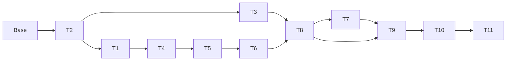

# Frontend Etapa 2 — plano técnico consolidado

> **ATUALIZAÇÃO DE CONTRATO (2026-09-16):** este plano deve consumir o resultado
> 2.0.0 e sua composição por mecanismo. Operações explícitas não são pré-netadas;
> toda apresentação de autonetting vem da API.

> **For agentic workers:** REQUIRED SUB-SKILL: `superpowers:executing-plans`, uma tarefa por vez, com TDD e gates abaixo. Não usar subagentes sem autorização explícita. Steps use checkbox (`- [ ]`) syntax for tracking. Este documento é planejamento; não executar implementação antes da aprovação final e da atribuição dos IDs MOT reais.

**Goal:** entregar criar → executar → salvar → recarregar → editar → detectar desatualização, mantendo dados locais por conta e resultados canônicos imutáveis.

**Architecture:** domínio local resolve autoria; aplicação coordena autosave/CAS/execução; IndexedDB fica atrás do repositório. Servidor prepara ordens pelo gerador público e executa o adaptador existente; UI só apresenta métricas canônicas.

**Tech Stack:** versões travadas da base: React 19.3.0, TypeScript 5.9.3, Vite 8.3.0, Router 7.18.3, TanStack Query 5.102.8, Supabase JS 2.116.0, decimal.js 10.6.0, Ajv 8.20.0; Python 3.11, FastAPI/Pydantic do lock; Vitest 5.0.0, Playwright 1.63.0, Chromium. IndexedDB nativo; fake-indexeddb dev travado na T1.

**Spec:** [especificação dedicada](../specs/2026-09-13-frontend-etapa-2-design.md). Leitura obrigatória também: [design geral](../specs/2026-09-11-frontend-motor-de-fluxo-design.md), [distribuição de modelos](2026-09-11-frontend-plano-geral-execucao-modelos.md), [ambiente](2026-09-11-frontend-ambiente-e-workflow.md), [plano técnico anterior](2026-09-11-frontend-etapa-1-plano-tecnico.md) e os seis registros `docs/frontend/` enumerados em S02 da especificação.

**Estado:** design e plano aprovados explicitamente pelo usuário em 2026-09-13 (mensagem “aprovado !”). Cadastro das missões autorizado; Envio dos documentos completos e cadastro autorizados explicitamente pelo usuário após a revisão automática. Cadastro confirmado na seção 13: MOT-23–MOT-33 em Backlog. Nenhuma funcionalidade implementada. Os comandos vermelhos são comandos a executar depois de escrever os testes indicados, não resultados observados nesta sessão.

## 1. Restrições globais e base

- Não alterar `motor/`, importar auxiliares privados nem reimplementar
  geração/P0/EDF/custos/economia/netabilidade em TypeScript. Preservar cada operação
  explícita e nunca pré-netar OUT/IN no front-end.
- Nenhum dado de negócio copiado do Obsidian; nenhuma calibração/regra regulatória inventada.
- Dinheiro armazenado/transportado como string decimal; arredondamento de exibição HALF_UP/pt-BR, sem Number para valores financeiros.
- Uma carteira/estudo, sem variantes/comparação funcional, distribuição robusta, replay, chat, relatório ou banco remoto.
- Autosave não executa; POST não repete automaticamente; cancelar espera não cancela computação.
- Sem criptografia adicional, nova senha ou exportação de recuperação. Erros nunca anunciam gravação que não concluiu.
- Um worktree por PR na execução; npm e locks; configuração real ignorada; nenhum UUID real, e-mail, senha, token ou chave nos artefatos.
- Publicação exige Diário no mesmo commit e `tipo: descrição (MOT-N)` real. Não cadastrar issues antes de aprovar este plano. Não reutilizar MOT-20/22.
- Não atualizar snapshots de teste só para passar; fixtures de resultado nascem do motor real.

Base após fetch desta sessão: `origin/main=a655d9d9fc166507e084b71bce98f2b601fb5d79`, merge PR #34. CI pós-merge [34776725007](https://github.com/altoe2025/MOTOR-DE-FLUXO/actions/runs/34776725007) success. MOT-15–22 Done confirmadas com comentários no Linear. Worktree documental `.worktrees/frontend-etapa-2-plano`, branch `codex/frontend-etapa-2-plano`. Checkout original e não rastreados preservados. Nova implementação deve repetir fetch, explicar qualquer avanço e registrar SHA; não usar main local antiga.

Baseline disponível é a CI do SHA confirmado. A sessão de planejamento não instala dependências nem afirma novos testes de runtime. Antes da primeira implementação, executar V0 abaixo no worktree limpo; falha existente é registrada sem alterar motor.

## 2. Inventário de implementação e fronteiras herdadas

| Existente | Reuso/mudança planejada |
|---|---|
| `web/src/study/types.ts`, `repository.ts`, `memoryRepository.ts` | Substituir contrato técnico mínimo por domínio local versionado; manter leitor de v1 explícito |
| `web/src/study/draftRecovery.ts` | Leitor legado, deixa de ser caminho de escrita da UI; nunca apagar original antes do import confirmado |
| `web/src/preview/PreviewProvider.tsx` | Adaptar coordenação à identidade estável do estudo; remover geração de study_id a cada clique |
| `web/src/api/client.ts`, `errors.ts` | Manter Bearer por chamada, timeout, erros sanitizados; acrescentar catálogo/capabilities/preparação |
| `web/src/api/generated.ts`, `schemas.json`, `validators.ts`, `web/scripts/generate-api.mjs` | Regenerar, acrescentar validadores novos; nunca editar gerados manualmente |
| `web/src/app/providers.tsx`, `AppShell.tsx`, `router.tsx`, `queryClient.ts` | Injetar StudyController por sessão; seletor; rota premissas funcional; manter GET retry limitado |
| `web/src/auth/AuthProvider.tsx`, `types.ts`, `supabaseClient.ts` | Manter SDK; timer de expiração e epoch/flush coordenados sem transportar credenciais ao domínio |
| `web/src/pages/PortfolioPage.tsx`, `PreviewPage.tsx` | Trocar referência como fluxo principal por editor e resultado ativo/histórico |
| `web/src/ui/*`, `web/src/styles/*`, `presentation/format.ts` | Reutilizar tokens/primitivos/formatadores; ampliar sem cálculos financeiros |
| `servidor/contracts/input.py`, `preview.py`, `primitives.py`, `output.py` | Preservar 1.0.0; novos DTOs em módulo próprio |
| `servidor/identity.py`, `motor_adapter.py`, `publication.py` | Preservar fingerprints e portão da prévia explícita |
| `servidor/routes/preview.py`, `app.py`, `export_openapi.py` | Compartilhar limite/slot com preparação e registrar rotas reais + schema factory |
| `contracts/fixtures/reference-request.json`, `reference-result.json` | Regressão obrigatória sem mudanças esperadas |
| `web/e2e/foundation.spec.ts`, `real-auth.spec.ts`, `web/playwright.config.ts` | Atualizar fluxo e testMatch; retirar shutdown antecipado por arquivo |
| `tests/web_api/run_e2e.py`, `test_e2e_server.py` | Duas identidades sintéticas, lifecycle após suíte completa, sem bypass em produção |
| `.github/workflows/test.yml`, `tests/web_api/test_acceptance_tooling.py` | Preservar job protegido `pytest`, acrescentar gates e teste de seleção E2E |

Interfaces públicas efetivas: `gerar_ordens(Arquetipo, cliente_id, seed, horizonte_dias) -> tuple[Ordem,...]`; `montar_especificacao_pool(mix,n_clientes,seed_base) -> dict[str,tuple[str,int]]`; `analisar`, `criar_manifesto`, `preparar_execucao_temporal`, `resultado_para_json`; `executar_previa(request, *, build_sha, relogio) -> PreviewEnvelope`. Catálogos: `motor.arquetipos.TODOS`, `motor.mixes.TODOS`, `motor.varredura.PARAMETROS_VARREDURA`. Não importar `_alocar_clientes`, `_seed_do_cliente`, `_jsonavel`.

## 3. Contratos locais completos

### 3.1 Tipos, primitivas e documento persistido

Tipos abaixo definem o contrato, não código já implementado. Criar `web/src/study/model.ts`; `types.ts` reexporta aliases HTTP e tipos locais para consumidores existentes. Datas UTC válidas no formato ISO com Z; UUID canônico minúsculo; revisões safe integer >=1. Origem temporal valida fuso; esquema serializado não aceita extras em nenhum objeto.

```typescript
import type { components } from '../api/generated';
export type CenarioEntrada = components['schemas']['CenarioEntrada'];
export type PeriodoEntrada = components['schemas']['PeriodoLegado'] | components['schemas']['PeriodoNatural'];
export type PreviewEnvelope = components['schemas']['PreviewEnvelope'];
export type PreviaRequest = components['schemas']['PreviaRequest'];
export type ProvenienciaEntrada = PreviaRequest['proveniencia'];
export type UUID = string;
export type UTC = string;
export type DecimalText = string;
export type SeedText = string;
export type Scope = Readonly<{ project_ref: string; owner_sub: UUID }>;
export type ProfileId = 'remessa_outbound_massiva' | 'psp_inbound' |
  'cripto_native_sem_fiat' | 'payroll_fornecedor' | 'exportador' | 'tesouraria_corporativa';
export type Source = {
  kind: 'PADRAO_SINTETICO' | 'ESTIMATIVA_USUARIO';
  source: string; recorded_at: UTC;
};
// raw conserva inclusive texto parcial: vazio, '-', '1,'; nunca significa valor zero.
export type DraftField = { raw: string; origin: Source | null };
export type Slot = { mode: 'inherit' } | { mode: 'own'; field: DraftField };
export type FieldKey = 'profile' | 'monthly_volume_brl' | 'ticket_median_brl' |
  'out_fraction' | 'deadline_mode' | 'deadline_days' | 'eh_efx' |
  'purpose_out' | 'purpose_in';
export type Group = { id: UUID; name: string; fields: Record<FieldKey, DraftField> };
export type Participant = {
  id: UUID; name: string; group_id: UUID | null; seed: SeedText;
  fields: Record<FieldKey, Slot>;
};
export type CostKey = 'iof_out' | 'iof_in' | 'carry_cnr' | 'spread_rail_bps' |
  'custo_fixo_remessa' | 'custo_oportunidade_aa' | 'ptax';
export type IofDraft = { id: UUID; purpose: DraftField; direction: DraftField; rate: DraftField };
export type AuthoredInput = {
  portfolio_id: UUID; groups: Group[]; participants: Participant[];
  costs: Record<CostKey, DraftField>; iof_rules: IofDraft[];
  warmup_days: DraftField; measurement_days: DraftField; window_days: DraftField;
  repetition: number;
  template: { id: ExampleId; catalog_version: string } | null;
};
export type ExampleId = 'equilibrado' | 'retail_pesado' | 'corporativo_pesado' |
  'psp_dominante' | 'outbound_extremo';
export type FieldIssue = { path: string; code: string; message: string };
export type Attempt = {
  id: UUID; request_id: UUID; tab_id: UUID; session_epoch: number;
  scenario_revision: number; started_at: UTC;
  phase: 'PREPARANDO' | 'EXECUTANDO';
};
export type PublicFailure = { code: string; message: string; fields: FieldIssue[]; request_id: UUID | null };
export type StudyDocument = {
  study_schema_version: '2.0.0'; id: UUID; scope: Scope; name: string;
  created_at: UTC; updated_at: UTC; created_by: UUID; updated_by: UUID;
  revision: number; scenario_id: UUID; scenario_revision: number;
  semantic_key: string; deleted_at: UTC | null;
  content: { kind: 'AUTHORED'; input: AuthoredInput } |
    { kind: 'LEGACY_EXPLICIT'; input: CenarioEntrada; period: PeriodoEntrada; provenance: ProvenienciaEntrada };
  current_preparation_id: UUID | null; execution_ids: UUID[];
  attempt: Attempt | null; last_failure: PublicFailure | null;
  last_operation_id: UUID;
};
export type PreparationRecord = {
  record_version: '1.0.0'; id: UUID; study_id: UUID; scope: Scope;
  received_at: UTC; envelope: PreparationResponse;
};
export type ExecutionRecord = {
  record_version: '1.0.0'; id: UUID; study_id: UUID; scope: Scope;
  received_at: UTC; preparation_id: UUID | null;
  authored_snapshot: AuthoredInput | null;
  preparation_snapshot: PreparationResponse | null;
  request_snapshot: PreviaRequest;
  numeric_key: string; evidence_key: string;
  envelope: PreviewEnvelope;
};
export type StoredRecord<T> = { bytes: number; digest: string; value: T };
export type OriginalRecord = {
  id: string; study_id: UUID; source_version: string;
  captured_at: UTC; original_json: string;
};
export type MigrationMarker = {
  source_key: string; source_digest: string; study_id: UUID;
  state: 'IMPORTED' | 'DELETED'; migrated_at: UTC;
};
export type OwnerMeta = { key: 'quota'; logical_bytes: number; study_count: number };
```

PreparationResponse e demais aliases HTTP novos são definidos em 4. Campos calculados: nenhuma data/hora de UI é evidência de origem; `recorded_at` muda só quando a origem muda, não ao resolver herança/salvar. IDs da regra IOF não entram no fingerprint numérico. Origin.source aceita 1–200 caracteres; raw até 200; nomes até 120. raw booleano somente `true|false` quando válido; profile catálogo; deadline_mode `PROFILE|FIXED`; direction `OUT|IN`. Parser pt-BR aceita dígitos com vírgula decimal, sem separador de milhar; gera decimal ASCII para API. Mostrar exemplo de entrada e rejeitar ponto/vírgula ambíguos, expoente, NaN e Infinity. raw incompleto/fora de domínio pode ser salvo; contagem/IDs/relações/extras inválidos não podem.

Schema runtime local: objetos fechados, todas as propriedades listadas obrigatórias, listas densas. `study.schema.json` representa exatamente os tipos acima; `$defs` reutiliza schemas HTTP por `$ref` resolvido localmente. Validador estrutural Ajv seguido por validação de relações, tamanhos e scope. `OriginalRecord.original_json` é texto opaco preservado, nunca executado. Sem objeto arbitrário persistido fora desse original.

`semantic_key`: SHA-256 de conteúdo efetivo numérico + evidência (se incompleto, chave de raws/relacionamentos sem nomes). Atualiza scenario_revision quando muda. `numeric_key` exclui evidência/nome, inclui IDs de participantes, valores efetivos, seeds, repetição, tempo e custos. `evidence_key` inclui origem efetiva por caminho estável. Mesmo numeric_key pode corresponder a revisão diferente; aceita validade por conteúdo, mas resposta exige revisão do request enviado. Nenhuma chave local substitui execution_fingerprint do servidor.

### 3.2 Estado e interfaces de domínio

```typescript
export type ResultState = { kind: 'AUSENTE' } |
  { kind: 'ATUAL'; execution_id: UUID; server_version: 'VERIFICADA' | 'NAO_VERIFICADA' } |
  { kind: 'DESATUALIZADO'; execution_id: UUID; reasons: Array<
    'ENTRADAS_ALTERADAS' | 'PROVENIENCIA_ALTERADA' | 'ENTRADA_INCOMPLETA' | 'VERSAO_ALTERADA'> };
export type PersistState = 'SALVO' | 'PENDENTE' | 'SALVANDO' | 'CONFLITO' | 'FALHA';
export type Validation<T> = { ok: true; value: T } | { ok: false; issues: FieldIssue[] };
export type Clock = () => UTC;
export type IdFactory = () => UUID;
export interface DomainServices {
  resolve(input: AuthoredInput): Validation<EffectiveInput>;
  fingerprint(input: AuthoredInput): Promise<{ semantic: string; numeric: string; evidence: string; generation: string }>;
  duplicate(study: StudyDocument, now: UTC, ids: IdFactory): StudyDocument;
  resultState(study: StudyDocument, execution: ExecutionRecord | null,
    keys: { numeric: string; evidence: string } | null, build: string | null): ResultState;
}
```

Funções exportadas reais seguem nomes `resolveInput`, `fingerprintInput`, `duplicateStudy`, `deriveResultState` em `domain.ts`/`fingerprints.ts`/`resultState.ts`; interface acima agrupa contratos, não exige classe. SHA com WebCrypto fora de transação. Canonicalização recursiva de chaves; entidades ordenadas por IDs e regras IOF por finalidade/direção (IDs de IOF excluídos); normalização decimal sem arredondar. Perfil inclui versão/dispersão na configuração efetiva do servidor, mas o input local identifica perfil e capabilities conhecido. Chaves gerativas locais excluem custos, janela e origens; keys canônicas servidor acrescentam build/catalog/generator.

### 3.3 Interface do repositório

```typescript
export type StudySummary = { id: UUID; name: string; revision: number; updated_at: UTC;
  deleted_at: UTC | null; availability: 'READY' | 'CORRUPT' | 'INCOMPATIBLE' };
export type RepoCode = 'STORAGE_UNAVAILABLE' | 'STORAGE_BLOCKED' | 'QUOTA_EXCEEDED' |
  'REVISION_CONFLICT' | 'DOCUMENT_CORRUPT' | 'SCHEMA_UNSUPPORTED' | 'MIGRATION_FAILED' |
  'OWNER_MISMATCH' | 'LOCAL_LIMIT_EXCEEDED' | 'NOT_FOUND' | 'ATTEMPT_CONFLICT' | 'INVALID_DOCUMENT' | 'STORAGE_CLOSED';
export type RepoError = Error & { code: RepoCode };
export type WriteOptions = { expected_revision: number | null; operation_id: UUID };
export interface StudyRepository {
  list(includeTrash: boolean): Promise<StudySummary[]>;
  get(id: UUID): Promise<StudyDocument | null>;
  save(study: StudyDocument, options: WriteOptions): Promise<StudyDocument>;
  getPreparation(id: UUID): Promise<PreparationRecord | null>;
  savePreparation(id: UUID, attemptId: UUID, preparation: PreparationRecord): Promise<StudyDocument>;
  getExecution(id: UUID): Promise<ExecutionRecord | null>;
  appendExecution(id: UUID, attemptId: UUID, record: ExecutionRecord): Promise<StudyDocument>;
  finishAttempt(id: UUID, attemptId: UUID, failure: PublicFailure): Promise<StudyDocument>;
  trash(id: UUID, options: WriteOptions): Promise<StudyDocument>;
  restore(id: UUID, options: WriteOptions): Promise<StudyDocument>;
  purge(id: UUID, options: WriteOptions): Promise<void>;
  removeExecution(id: UUID, executionId: UUID, options: WriteOptions): Promise<StudyDocument>;
  importLegacy(sourceKey: string, raw: string): Promise<StudyDocument>;
  close(): void;
}
// scope confiável vem de Auth; não é argumento recebido das telas a cada operação.
export function openStudyRepository(scope: Scope, factory: IDBFactory): Promise<StudyRepository>;
```

save(null revision) cria, save(N) atualiza apenas autoria/metadados editáveis do cliente e incrementa para N+1. Bloquear tentativa ativa concorrente na criação/reserva; não permitir que save comum remova attempt/execution_ids nem troque scope/id/scenario_id. Atualização ordinária exige IDs protegidos iguais ao registro atual. Reserva é feita por `save` com attempt novo somente se atual nulo ou substituição explicitamente autorizada após espera; T6 define `reserveAttempt` como função de aplicação que relê/CAS, não método escondido. `finishAttempt` condicional não apaga tentativa mais recente.

savePreparation/appendExecution operam em transação sobre revisão atual, verificam attempt_id, scope, IDs enviados e não substituem content. append é idempotente por execution_id + digest; igual retorna sucesso, ID igual/conteúdo diferente é DOCUMENT_CORRUPT. Muda current_preparation_id apenas se autoria gerativa vigente corresponder; histórico pode anexar mesmo após edição. Opções de remoção exigem revisão, proíbem remover registro usado por attempt ativo. Confirmação UI precede métodos destrutivos; repositório ainda revalida relações.

## 4. Contratos HTTP novos e geração

### 4.1 Tipos completos e versões

Adicionar `servidor/contracts/preparation.py`, tipos gerados em api. Todos os objetos fechados Pydantic strict; campos abaixo obrigatórios. Usar DecimalText e UUIDValue existentes. Nomes ingleses deliberados no contrato novo, mantendo `cenario/periodo/proveniencia` apenas na API herdada.

```typescript
export type EffectiveSource = Source;
export type EffectiveParticipant = {
  id: UUID; profile: ProfileId; seed: SeedText;
  monthly_volume_brl: DecimalText; ticket_median_brl: DecimalText;
  out_fraction: DecimalText;
  deadline: { mode: 'PROFILE' } | { mode: 'FIXED'; days: number };
  eh_efx: boolean; purpose_out: string; purpose_in: string;
};
export type EffectiveInput = {
  participants: EffectiveParticipant[];
  warmup_days: number; measurement_days: number; window_days: number;
  costs: CenarioEntrada['custo'];
  sources: Record<string, EffectiveSource>;
};
export type PreparationRequest = {
  preparation_version: '1.0.0'; request_id: UUID; study_id: UUID;
  scenario_id: UUID; scenario_revision: number;
  expected_build_sha: string; input: EffectiveInput;
};
export type DerivedEvidence = {
  rule: 'dimensionamento-v1' | 'geracao-v1' | 'soma-ordens-v1';
  inputs: string[]; // paths estáveis de sources ou /participants/<uuid>/seed ou /catalog/<profile>
};
export type RealizedComposition = {
  participant_id: UUID | null; order_count: number;
  out_brl: DecimalText; in_brl: DecimalText; total_brl: DecimalText;
  out_fraction: DecimalText | null;
};
export type PreparationResponse = {
  preparation_version: '1.0.0'; preparation_id: UUID; request_id: UUID;
  study_id: UUID; scenario_id: UUID; scenario_revision: number;
  created_at: UTC; motor_build_sha: string; generator_version: 'dimensionamento-v1';
  catalog_version: '1.0.0'; generation_fingerprint: string;
  input_snapshot: EffectiveInput;
  orders: CenarioEntrada['ordens'];
  parameters: Array<{ participant_id: UUID; sigma: DecimalText;
    cadence_monthly: DecimalText; expected_period_brl: DecimalText;
    deadline_min: number; deadline_max: number }>;
  composition: RealizedComposition[];
  derived_provenance: Record<string, DerivedEvidence>;
};
export type ProfileTemplate = {
  id: ProfileId; ticket_median_brl: DecimalText; sigma: DecimalText;
  cadence_monthly: DecimalText; monthly_volume_brl: DecimalText;
  out_fraction: DecimalText; deadline_min: number; deadline_max: number;
  eh_efx: boolean; purpose_out: string; purpose_in: string;
};
export type ExampleTemplate = { id: ExampleId; label: string; weights: Record<ProfileId, DecimalText>;
  participants: Array<{ template_id: string; profile: ProfileId; seed: SeedText }> };
export type CatalogResponse = {
  catalog_version: '1.0.0'; motor_build_sha: string;
  profiles: ProfileTemplate[]; examples: ExampleTemplate[];
  costs: CenarioEntrada['custo']; source: string; recorded_at: UTC;
};
export type Capabilities = {
  preparation_version: '1.0.0'; preview_version: '1.0.0'; presentation_version: '1.0.0';
  motor_schema_version: '2.0.0'; generator_version: 'dimensionamento-v1';
  catalog_version: '1.0.0'; motor_build_sha: string;
  max_orders: 1000; max_expected_orders: 500;
};
```

`source` do catálogo usa caminho público técnico, `recorded_at` fixo `2026-09-13T00:00:00Z` para catálogo v1, não o instante de cada GET. ExemploTemplate contém exatamente 12 entradas via API pública. Capturar as finalidades da tabela e cada perfil; não completar regra IOF ausente. Todos os valores derivados são decimais textuais ASCII finitos, máximo 80 caracteres.

sources exige por participante profile, monthly_volume_brl, ticket_median_brl, out_fraction, deadline/mode, deadline/days se FIXED, eh_efx, purpose_out/in; por custo todas as sete chaves e regras identificadas por par finalidade/direção escapado JSON Pointer; global warmup_days/measurement_days/window_days. Não exigir origem de ID/seed. Rejeitar caminho desconhecido/ausente com `ORIGEM_AUSENTE|ORIGEM_INVALIDA`. Origens de seed/regra de geração são derived_provenance, não estimativa de negócio.

Derived_provenance contém caminho estável `/orders/<order-id>/<field>` para valor, direção, dia conhecida/limite, finalidade, eFX; parameters cadence/expected_volume e composition somas também têm regra e inputs. Converter para proveniência 1.0.0 após ordenar orders; campos direction antes opcionais no legado recebem origem também. Cópia de custo proveniente de tabela usa origem do catálogo; edição muda para ESTIMATIVA_USUARIO.

### 4.2 Endpoints e assinaturas

| Endpoint novo | Resposta/semântica |
|---|---|
| `GET /api/v1/capabilities` | Capabilities, autenticado/no-store, sem dados pessoais |
| `GET /api/v1/examples/catalog` | CatalogResponse, autenticado/no-store, somente definição, sem geração de ordens |
| `POST /api/v1/preparacoes` | PreparationRequest → PreparationResponse, 200 completo, autenticado antes de parse/cálculo |

Não alterar endpoints de referência/session/health/previas. Registrar os três novos tanto na factory real quanto em create_schema_app; contract factory continua sem rede/settings/segredos. API geral continua 1.0.0 pois endpoints existentes não mudam; contrato de preparação tem versão própria. Mudança incompatível futura exige nova versão/rota, não literal mais permissivo silencioso.

```python
def build_catalog(*, build_sha: str) -> CatalogResponse: ...
def dimension_participant(participant: EffectiveParticipant) -> Arquetipo: ...
def prepare_portfolio(request: PreparationRequest, *, build_sha: str,
                      clock: Callable[[], datetime]) -> PreparationResponse: ...
```

Assinaturas usam reticências somente como notação de assinatura; implementação mínima descrita na T3 não é stub a entregar. `prepare_portfolio` resolve catálogo por build, calcula frequências, impõe expectativa antes de gerar, chama gerar_ordens por ID ordenado, revalida ordens com OrdemEntrada, calcula composição sobre coorte [A,A+M), valida total/global, constrói evidência e envelope. Não simula P0 nessa operação. Custos válidos no input para o snapshot/proveniência mas excluídos do generation_fingerprint, assim como janela e fontes. fingerprint inclui tempo, participantes completos, build e generator/catalog. JSON canônico segue normalização Decimal/Python existente sem importar auxiliares privados; extrair normalização pública só de servidor se necessário.

Dois POSTs podem ocorrer por execução do usuário: preparação se cache gerativo inválido; prévia sempre. Nenhum resultado financeiro publicado antes de ambos os gates relevantes. Em nova build, refazer preparação. Se build mudar entre preparation e preview, rejeitar envelope para apresentação atual e registrar VERSAO_ALTERADA; não reexecutar automaticamente.

### 4.3 Erros públicos exatos

| Código | HTTP/local | Casos e ação |
|---|---|---|
| JSON_INVALIDO | 400 | Corpo inválido; corrigir request, nenhum cálculo |
| SESSAO_INVALIDA | 401 | Credencial ausente/expirada; login mantendo dados |
| ACESSO_NAO_PERMITIDO | 403 | Fora da allowlist; leitura local enquanto sessão válida, cálculo negado |
| VERSAO_INCOMPATIVEL | 409 | preparação !=1.0.0 ou build esperado diferente; atualizar app/capabilities |
| LIMITE_EXCEDIDO | 413 | Body >1 MiB, antes de parse |
| PREPARACAO_EXCEDE_LIMITE | 413 | Preparação >2 MiB, sem resposta parcial |
| RESULTADO_EXCEDE_LIMITE | 413 | Envelope prévia >8 MiB, herdado |
| ENTRADA_INVALIDA | 422 | Domínio, extras, referência, seed, custo ou período inválidos |
| GERACAO_EXCEDE_LIMITE | 422 | Esperadas >500 ou geradas >1.000; nunca truncar/reseed |
| GERACAO_INVALIDA | 422 | Ordem não positiva/arredondada a zero ou acima do DTO; preservar edição |
| CAPACIDADE_OCUPADA | 429 | Slot único já usado em preparação/prévia; Retry-After 1 |
| RESULTADO_INVALIDO | 500 | Falha do portão existente; sem envelope |
| ERRO_INTERNO | 500 | Falha inesperada sanitizada, sem stack/corpo |
| AUTH_INDISPONIVEL | 503 | JWKS indisponível sem chave válida, herdado |
| TEMPO_ESGOTADO | cliente | 30 s; fim da espera, cálculo pode continuar |
| RESPOSTA_INVALIDA / CONTEXTO_DIVERGENTE | cliente | Forma/IDs/snapshot diferentes; não renderizar resultado como aceito |
| ENTRADA_CLIENTE_INVALIDA | cliente | Validation.issues; focar primeiro erro, sem HTTP |
| EXECUCAO_INTERROMPIDA | local | F5/encerramento de espera; não retomar POST automaticamente |

fields: `OBRIGATORIO`, `DECIMAL_INVALIDO`, `FORA_DO_LIMITE`, `INTEIRO_INVALIDO`, `REFERENCIA_INVALIDA`, `DUPLICADO`, `ORIGEM_AUSENTE`, `ORIGEM_INVALIDA`, com path estável de autoria. Adaptar erros Pydantic dos contratos novos a esses códigos; legado mantém seus códigos atuais. Client mostra mensagem sanitizada/fields; não salva headers/token/erro bruto. Erros RepoCode de 3.3 mapeiam às mensagens de S13; não são status HTTP.

## 5. Armazenamento físico, migrations e máquinas de estado

### 5.1 Stores e atomicidade

Banco por scope, versão 1. Object stores: `studies` keyPath `value.id`, índice `by_updated` em `value.updated_at`; `preparations` keyPath `value.id`, índice `by_study` em `value.study_id`; `executions` mesmos índices; `originals` keyPath `value.id`, índice `by_study`; `migrations` keyPath `source_key`; `meta` keyPath `key`. Primeiros quatro usam StoredRecord. Meta e markers armazenados diretamente com esquema fechado. List summaries percorre studies sem carregar executions; inválido aparece CORRUPT pelo ID da chave, sem renderizar conteúdo arbitrário.

bytes = TextEncoder(JSON.stringify(value)).byteLength para StoredRecord, digest SHA-256 dos bytes. Quota inclui JSON do wrapper completo (bytes/digest/value), markers e meta, atualizada na mesma transação; meta tem tamanho variável, recalcular até contagem estável (no máximo mudanças no número de dígitos; testar fronteira). max documento aplica bytes do StudyDocument; max execução aplica ExecutionRecord completo, incluindo preparação duplicada. Record exec inclui preparação própria para não depender de cache mutável; isso conta na quota. Não contar duas vezes por referência, apenas os bytes realmente armazenados logicamente.

Transação save: preparar validação/digest fora; abrir stores studies/meta com strict durability; get atual → checar scope/revisão/operação → verificar capacidade → put documento/wrapper/meta → resolver só em complete; abort rejeita. Operação já aplicada (last_operation_id igual e conteúdo pretendido equivalente) é sucesso. Mesmo operation_id/conteúdo diferente falha. Sem await de WebCrypto dentro da transação.

appendExecution: pré-validar tudo; transação studies/executions/preparations/meta; reler estudo; se execution_id existente idêntico retornar sucesso; se não, conferir attempt_id/retenção/conta e digests; anexar registro e IDs preservando content/revisão atual; limpar tentativa, atualizar quota/revisão. Caso revisão mude enquanto pré-processa, reler/autoria atual não se perde; mutação não escreve cópia antiga inteira. finishAttempt atualiza só falha e attempt condicional. Nunca decrementar revisão ou sobrescrever autoria com input_snapshot do servidor.

### 5.2 Migrations executáveis

| Origem | Conversão | Recusa/preservação |
|---|---|---|
| localStorage draft version 1 | Validar chaves exatas/owner/data/nome; criar estudo AUTHORED incompleto UUID novo; warmup 0, medida 30, janela 7 sintéticos; custos/grupos/participantes vazios; marker pela chave de origem | JSON inválido mantém raw; sem auto reset; marker único impede importar duas vezes |
| StudyDocument 1.0.0 | Validar esquema antigo, base/resultado/owner; construir LEGACY_EXPLICIT em leitura, UUIDs antigos válidos preservados, IDs inválidos causam recusa; sem participantes inferidos | variants não vazias/selected_replay não nulo/resultado de outro estudo → MIGRATION_FAILED; raw preservado |
| StudyDocument 2.0.0 | Validar wrapper/digest/estrutura/relações; nenhuma conversão | DOCUMENT_CORRUPT em falha |
| versão desconhecida | Não converter | SCHEMA_UNSUPPORTED; sem apagar/downgrade |

Original v1 em IndexedDB é lido como raw antes de exigir wrapper v2. Criar original+destino+execuções extraídas+marker+quota atomicamente. Guardar conteúdo exato JSON disponível, não afirmar bytes históricos se origem já for objeto estruturado. Falta de quota aborta tudo. Marker não depende de nome nem updated_at; atualização do velho draft depois de importado não sobrescreve v2, mostra que já foi importado. Purge muda marker para DELETED; não ressuscita no próximo login. Custos de draft vazio são DraftField raw vazio/origin null, não zeros. Origem padrão temporal é catálogo v1 técnico.

### 5.3 Fluxo de ponta a ponta

```text
login válido → scope/epoch → abrir repositório → importar draft uma vez → listar
criar/editar → resolver herança → chave semântica → revision lógica → autosave CAS
executar → flush confirmado → validar entrada/capabilities/retenção → reservar attempt CAS
  → preparação compatível existente OU POST preparacoes → salvar preparação
  → montar request explícito → POST previas → validar envelope/contexto/snapshot
  → append atômico → calcular validade contra autoria vigente → apresentar
editar → desatualizar imediatamente → autosave; nenhum POST automático
F5 → reabrir banco → validar documentos → tentativa interrompida → nenhum POST
```

Attempt com tab_id persistido no sessionStorage por aba; nenhuma credencial ali. session_epoch monotônico em memória muda em transição de auth, mesmo A→B→A. Continuidade de aba após F5 não prova request vivo: controller começa sem inFlight, tentativa desse tab vira EXECUCAO_INTERROMPIDA por operação condicional. Outra aba mostra tentativa remota; após 30 s permite substituição explícita com CAS (não cancelamento computacional). Relógio só habilita a ação, nunca resolve concorrência. Corrida de término/substituição: apenas attempt_id atual pode anexar.

Autosave não substitui attempt/results armazenados. Ao iniciar flush espera última alteração já capturada; ao digitar durante flush, mantém PENDENTE e grava próxima revisão. Hash assíncrono usa sequence number; conclusão tardia nunca promove edição antiga. Em storage falho, nenhum timer repete infinitamente; Tentar novamente reabilita uma gravação. beforeunload somente quando há dados não confirmados, sem depender dele para salvar. Expiração não apaga pendência privada, mas não permite ler estudo sem nova sessão válida.

## 6. Verificação padronizada e commits

Todos os comandos partem da raiz do worktree. Em Windows usar `.venv\Scripts\python.exe` no lugar de `python`; em CI Python 3.11 está no PATH. Não copiar venv/node_modules/configuração de outro worktree.

**V0 — baseline e instalação na execução:**

```powershell
python -m venv .venv
.\.venv\Scripts\python.exe -m pip install -r requirements/web-dev.lock
.\.venv\Scripts\python.exe -m pip install --no-deps -e .
npm --prefix web ci
.\.venv\Scripts\python.exe -m pytest -q
.\.venv\Scripts\python.exe -O -m pytest -q
npm --prefix web run test:unit
npm --prefix web run typecheck
npm --prefix web run lint
npm --prefix web run build
```

Se `python` não existir no PATH, usar o CPython 3.11 instalado encontrado no ambiente; registrar seu caminho, não presumir `py`. Nenhum desses comandos de implementação foi executado para fingir baseline novo nesta sessão.

**V1 — verificação completa obrigatória ao concluir cada tarefa de código:**

```powershell
.\.venv\Scripts\python.exe -m pytest -q
.\.venv\Scripts\python.exe -O -m pytest -q
.\.venv\Scripts\python.exe -m ruff check servidor tests/web_api
.\.venv\Scripts\python.exe -m mypy servidor
npm --prefix web run test:unit
npm --prefix web run typecheck
npm --prefix web run lint
npm --prefix web run build
git diff --exit-code -- motor
```

**V2 — contrato, obrigatório T1/T2/T3/T8 e todo PR que muda API:**

```powershell
.\.venv\Scripts\python.exe -m servidor.export_openapi
npm --prefix web run generate:api
```

Rodar duas vezes, comparar os bytes dos artefatos entre gerações; primeira geração pode alterar contratos deliberadamente. CI compara com os arquivos commitados via `git diff --exit-code -- contracts web/src/api/generated.ts web/src/api/schemas.json web/src/api/validators.ts`. Acrescentar schema local aos checks somente se gerado (neste plano é fonte versionada).

**V3 — integração/browser/empacotamento por PR funcional e T10/T11:**

```powershell
npm --prefix web run test:e2e
.\.venv\Scripts\python.exe -m tests.web_api.scan_credentials
.\.venv\Scripts\python.exe -m tests.web_api.measure_reference --max-p95-ms 5000
.\.venv\Scripts\python.exe -m build --wheel
```

Wheel precisa ser instalada em venv temporária própria e importada de fora do checkout, igual gate CI existente. Não executar instalação forçada sobre ambiente pessoal. Validar inclusão motor/servidor/YAML/catálogo gerado em código.

**C — commit:** cada tarefa abaixo informa título sem inventar número. Depois da aprovação/cadastro, responsável registra mapeamento Tn→MOT-N em `docs/frontend/etapa-2-operacao.md`; antes de commit exige `$env:MOT_ISSUE` corresponder a `^MOT-[0-9]+$` e à tarefa. Exemplo de execução seguro:

```powershell
if ($env:MOT_ISSUE -notmatch '^MOT-[0-9]+$') { throw 'Issue real obrigatória' }
git commit -m ('feat: contrato local de estudos (' + $env:MOT_ISSUE + ')')
```

Título concreto varia por T. `git add` somente arquivos da tarefa e Diário; nunca `git add .` sem inspeção. Cada tarefa atualiza Diário com sintoma/causa/feito/invalidação e operação com comandos/resultados. Aprovar este documento não autoriza merge automático.

## 7. Tarefas revisáveis

Cada tarefa inclui V1 como validação completa, além dos gates indicados. TDD: escrever os casos listados, executar vermelho por comportamento ausente, implementar mínimo, passar testes, revisar e atualizar documentação. Nomes de arquivo abreviados em cada inventário continuam sob o último diretório explícito da mesma área; estilos existentes significa web/src/styles/global.css e web/src/styles/tokens.css; operação e Diário significam docs/frontend/etapa-2-operacao.md e docs/DIARIO-DE-MUDANCAS.md. Trechos de testes são âncoras; os demais casos e expectativas listados têm a mesma obrigatoriedade. Helpers citados são definidos em T1/T2 e não fixtures externas invisíveis.

### T1 — Domínio local, schemas e fixtures de autoria

**Responsável:** Astra/Medium para fechar contrato revisado; Terra/Medium implementa formas/validação sob contrato. Essa concentração Astra é justificada pela evolução material do StudyDocument, permitida pelo plano geral; não é distribuição automática de trabalho a subagentes.

**Criar:** `web/src/study/model.ts`, `domain.ts`, `fingerprints.ts`, `resultState.ts`, `study.schema.json`, `validation.ts`, `domain.test.ts`, `fingerprints.test.ts`, `resultState.test.ts`, `fixtures.ts`, `legacyTypes.ts`.
**Modificar:** `web/src/study/types.ts`, `repository.ts`, `memoryRepository.ts`, `memoryRepository.test.ts`, `web/package.json`, `web/package-lock.json`, `docs/frontend/etapa-2-operacao.md`, Diário.
**Consome:** aliases HTTP herdados e novos de T2, S05/S08. **Produz:** tipos de §3, funções DomainServices, MemoryStudyRepository conforme §3.3; `makeStudy(scope?, ids?)`, `makeParticipant(id, groupId?)`, `makeGroup(id)` fixtures exportadas apenas para teste, com UUIDs sintéticos fixos e relógio 2026-09-13T00:00:00Z.
**Dependências:** base V0 e T2. **Libera:** T4/T7. **Commit:** `feat: contrato local de estudos` + C.

- [ ] Criar teste com grupo volume raw `10000000`, três participantes herdados, um override raw `20000000`; modificar grupo para `12000000`: dois resolvem 12M, personalizado permanece 20M. Nome muda sem numeric_key mudar; reorder idem.
- [ ] Cobrir IDs repetidos, grupo inexistente, inherit sem grupo, fonte nula, número incompleto, zero/negativo/expoente, custo inválido, soma temporal 731, prazo 366 e vazio. Estrutura inválida recusa persistência; raw incompleto persiste e resolveInput retorna issues.
- [ ] Escrever âncora:

```typescript
it('nome não altera identidade numérica', async () => {
  const a = makeStudy();
  if (a.content.kind !== 'AUTHORED') throw new Error('fixture');
  const before = await fingerprintInput(a.content.input);
  a.content.input.participants[0].name = 'Nome revisto';
  expect((await fingerprintInput(a.content.input)).numeric).toBe(before.numeric);
});
```

- [ ] Vermelho: `npm --prefix web run test:unit -- src/study/domain.test.ts src/study/fingerprints.test.ts`; esperar módulo ausente, depois falha de comportamento, nunca fixture inválida como suposto sinal funcional.
- [ ] Implementar resolução de cada Slot por group_id, parsers puros e validators, comparação decimal canônica e hashes com sequenciamento no consumidor; deep clone nas fronteiras.
- [ ] Instalar dev `fake-indexeddb` com `npm --prefix web install --save-dev --save-exact fake-indexeddb`; registrar versão resolvida/compatibilidade Node24 no lock e operação. CI usa npm ci, não resolve novamente.
- [ ] Implementação mínima da herança:

```typescript
const slot = participant.fields[key];
const field = slot.mode === 'own' ? slot.field : group?.fields[key];
if (field === undefined) issues.push({ path, code: 'REFERENCIA_INVALIDA', message: 'Grupo indisponível.' });
```

- [ ] Cobrir raw 1,0/1,00 mesma key, A→B→A mesma key final, mudança só de fonte evidence diferente/numeric igual, dinheiro grande sem Number; duplicação remapeia relações, mantém sementes e zera execução.
- [ ] V1; revisar schema contra cada campo de §3; documentar e C.

**Conclusão:** documento incompleto persistível; entrada executável tipada; nenhuma função de domínio importa React/IndexedDB; contratos locais completos sem cast como validação.

### T2 — DTOs HTTP de preparação e catálogo

**Responsável:** Sol/Medium; Astra somente revisão de mudança contratual identificada. **Criar:** `servidor/contracts/preparation.py`, `tests/web_api/test_preparation_contracts.py`, `contracts/fixtures/authored-input.json`.
**Modificar:** `servidor/app.py` (schema factory), `servidor/contracts/__init__.py`, `web/scripts/generate-api.mjs`, `contracts/openapi.json`, `web/src/api/generated.ts`, `web/src/api/schemas.json`, `web/src/api/validators.ts`, `tests/web_api/conftest.py`, operação (criar `docs/frontend/etapa-2-operacao.md`), Diário.
**Consome:** §4/S06/S07 e primitivos Pydantic. **Produz:** EffectiveInput/PreparationRequest/Response/Catalog/Capabilities e validadores AJV correspondentes; fixture sintética input de 1 participante mediana `1000`, volume `10000`, fração `0.5`, prazo fixo 7, NATURAL 0/30, custos da referência, fontes técnicas.
**Dependências:** base V0. **Libera:** T1/T3/T8. **Commit:** `feat: contratos de preparação de carteira` + C.

- [ ] Escrever parametrizações: seed number/negativa/>2^63−1 rejeitada; money number, 7 casas, volume zero; profile desconhecido; 101 participantes; duplicate ID; prazo 366; soma A+M=731; fonte ausente/extra; finalidades com espaços externos; IOF par duplicado; `true` em inteiro → 422/ValidationError.
- [ ] Âncora e vermelho:

```python
def test_seed_preserva_inteiro_acima_do_limite_js(authored_payload):
    authored_payload['input']['participants'][0]['seed'] = '9223372036854775807'
    dto = PreparationRequest.model_validate(authored_payload)
    assert dto.input.participants[0].seed == '9223372036854775807'
```

`python -m pytest tests/web_api/test_preparation_contracts.py -q` falha por import ausente antes dos DTOs.

- [ ] Definir fixture `authored_payload` em `tests/web_api/conftest.py` lendo authored-input.json com UUIDs sintéticos e deepcopy por teste. Todos os campos de §4.1 presentes. Definir também authored_request como PreparationRequest.model_validate(authored_payload), e clock como callable retornando datetime UTC fixo 2026-09-13T00:00:00Z, para T3.
- [ ] Implementar StrictModel, regras de sources/tempo/limites. Erros de fields estáveis em caminhos de IDs, sem dados de entrada em mensagens.
- [ ] Acrescentar schema das novas rotas sem alterar schemas existentes; gerar tipos/runtime e criar aliases em `web/src/api/client.ts` somente quando T8 implementar métodos.
- [ ] V1/V2; comparar schemas antigos e fixtures reference sem alteração inesperada; documentar/C.

**Conclusão:** schema valida forma em JS e semântica integral no servidor; versões explícitas, geração determinística de artefatos.

### T3 — Dimensionamento, exemplos e rotas reais

**Responsável:** Sol/Medium. **Criar:** `servidor/catalog.py`, `preparation.py`, `preparation_identity.py`, `routes/preparation.py`, `routes/capabilities.py`, `transport_limits.py`, `tests/web_api/test_preparation.py`, `test_preparation_http.py`, `test_catalog.py`, `generate_preparation_fixture.py`, `contracts/fixtures/preparation-result.json`.
**Modificar:** `servidor/app.py`, `routes/examples.py`, `routes/preview.py` (somente extração de limite e slot compartilhado), `tests/web_api/conftest.py`, operação, Diário.
**Consome:** T2; funções públicas do motor; §4. **Produz:** três endpoints, build_catalog/dimension_participant/prepare_portfolio, preparação fixture gerada pelo motor.
**Dependências:** T2. **Libera:** T8/T9. **Commit:** `feat: geração de carteiras pelos perfis do motor` + C.

- [ ] Testar cálculo com sigma=0 por objeto de perfil sintético de teste: 10000/1000=10 operações esperadas/mês. Perfil real usa sigma do catálogo; verificar cálculo Decimal e cadência a 12 casas, sem volume ajustado após sorteio.
- [ ] Testar mesmos inputs/seeds/build → mesmas ordens; apenas nome UI não chega ao request; adição/remoção de B conserva ordens A; custos/janela/origem não mudam generation_fingerprint; prazo/direção/ticket/seed/build mudam.
- [ ] Âncora:

```python
def test_mesma_carteira_produz_mesmas_ordens(authored_request, clock):
    a = prepare_portfolio(authored_request, build_sha='a'*40, clock=clock)
    b = prepare_portfolio(authored_request, build_sha='a'*40, clock=clock)
    assert a.orders == b.orders
    assert a.generation_fingerprint == b.generation_fingerprint
```

- [ ] Vermelho: `python -m pytest tests/web_api/test_preparation.py tests/web_api/test_catalog.py -q`, módulo ausente.
- [ ] Implementação mínima numérica:

```python
with localcontext() as ctx:
    ctx.prec = 50
    mean = median * (sigma * sigma / Decimal(2)).exp()
    cadence = (volume / mean).quantize(Decimal('0.000000000001'), rounding=ROUND_HALF_UP)
if cadence <= 0:
    raise PreparationInputError('GERACAO_INVALIDA')
```

PreparationInputError é erro novo em preparation.py com `code: str`, convertido na rota em ApiFailure 422; não capturar Exception como validação de domínio. Montar Arquetipo com campos completos do catálogo/customização, converter somente float exigido pelo motor. chamar gerar_ordens, revalidar saídas e somar Decimal na coorte; converter seed textual com int Python.

- [ ] Testar 500 esperadas aceitas, 500.000000000001 recusadas antes de chamar motor, 1.001 reais recusadas (gerador substituído só nesse teste de limite), ordem zero/valor>1e12/7 casas recusada sem reamostra. Vazio gera composição total zero/fração null.
- [ ] Testar catálogos cinco IDs/nomes/12 participantes, fontes fixas, custos iguais ao PARAMETROS_VARREDURA e lista IOF completa. Fixtures não contêm empresa real nem dados observados.
- [ ] Testar A=10/M=20: ordens dias 0–9 fora da composição medida, dia10 dentro, dia30 proibido; em caso separado A=365/M=365/prazo=365, dia_limite até1094 e horizonte_dias=730, dentro dos limites distintos de OrdemEntrada e CenarioEntrada; nenhuma métrica financeira recalculada.
- [ ] Rotas: auth antes de body; versão explícita diferente de 1.0.0 é recusada com409 antes de model_validate; 1MiB+1/2MiB+1 limites; POST simultâneo preparação/prévia recebe429; health permanece200; erro libera slot em finally; build divergente409; versão ausente422; output invalidado não parcial.
- [ ] Gerar fixture com relógio/UUID fixos em módulo exclusivamente de geração, duas vezes idêntica; V1/V2/V3; comparar referência numérica; documentar/C.

**Conclusão:** cinco exemplos preparáveis com contratos reais e nenhuma alteração motor; limites e evidência aplicados antes de publicação.

### T4 — Repositório IndexedDB e atomicidade

**Responsável:** Terra/Medium, com critérios CAS definidos neste plano. **Criar:** `web/src/study/indexedDbRepository.ts`, `storageRecords.ts`, `repository.contract.test.ts`, `indexedDbRepository.test.ts`. **Modificar:** `repository.ts`, `memoryRepository.ts`, respectivos testes em `web/src/study/`, operação e Diário.
**Consome:** contratos locais de §3, stores/transações de §5. **Produz:** openStudyRepository e todos os métodos de §3.3, implementados também no repositório em memória para executar o mesmo contrato de testes.
**Dependências:** T1. **Libera:** T5/T6. **Commit:** `feat: persistência transacional dos estudos` + C.

- [ ] Escrever suíte compartilhada parametrizada por factory; executar contra memória e fake-indexeddb. Dados: duas contas e projetos sintéticos, um estudo revision=1 e dois writers esperando revision=1.
- [ ] Testar criação/leitura sem alias mutável; escrever cópia não muda envelope original; segundo writer recebe REVISION_CONFLICT e não substitui o primeiro. Duas chamadas com mesmo operation_id não duplicam gravação; operation_id diferente não contorna CAS.
- [ ] Vermelho: `npm --prefix web run test:unit -- src/study/repository.contract.test.ts src/study/indexedDbRepository.test.ts`; factory nova ausente.
- [ ] Criar stores e índices de §5 em onupgradeneeded; validar scope, schema, tamanho e digest fora da transação. Recontar delta de bytes e revisão dentro da transação, inclusive quando dois estudos da conta salvam juntos.
- [ ] Confirmar sucesso exclusivamente em transaction.oncomplete. Injetar abort após put do estudo e antes de put do resultado: nenhum dos dois deve persistir. Não usar Promise de hash/fetch no corpo da transação.
- [ ] Testar 30 estudos incluindo lixeira, 10 resultados, 1 MiB de documento, 12 MiB de execução e 150 MiB lógicos nos limites inclusivos e +1. Abortar por quota não muda meta, referências nem estudo; quota física menor retorna QUOTA_EXCEEDED.
- [ ] appendExecution relê estudo e exige attempt_id vigente; preserva edição posterior, não exige que a revisão atual ainda seja a enviada. Resultado fica histórico se fingerprint divergiu. Tentativa substituída retorna ATTEMPT_CONFLICT e não grava.
- [ ] savePreparation e appendExecution conferem estudo/cenário/conta/request/revisão enviada e snapshots; não permitem referências cruzadas. Preparação anterior ainda referenciada por resultado não é removida.
- [ ] Testar list sem materializar envelopes, close/versionchange, blocked, digest errado em um registro e continuidade de outro. Repositório fechado retorna STORAGE_CLOSED; escopo divergente retorna OWNER_MISMATCH antes de mutação.
- [ ] V1; documentar limites de fake-indexeddb e encaminhar prova Chromium a T10; documentar/C.

**Conclusão:** contrato compartilhado passa nas duas implementações, abort é atômico, CAS e quota são transacionais; telas não importam IDB.

### T5 — Migrações, lixeira e recuperação local

**Responsável:** Terra/Medium. **Criar:** `web/src/study/migrations.ts`, `migrations.test.ts`, `lifecycle.ts`, `lifecycle.test.ts`, `fixtures/legacy-draft.json`, `fixtures/legacy-study.json` (todos os caminhos fixtures sob `web/src/study/`). **Modificar:** `draftRecovery.ts`, `indexedDbRepository.ts`, `storageRecords.ts`, operação e Diário.
**Consome:** T4 e tabela §5. **Produz:** importLegacy, trash/restore/purge/removeExecution e duplicateStudy integrados ao repositório; leitor legado sem nova escrita.
**Dependências:** T4. **Libera:** T6/T7/T10. **Commit:** `feat: migração e ciclo de vida local dos estudos` + C.

- [ ] Testar draft version=1 com study_id=stage-1-draft: novo UUID, nome preservado, carteira vazia incompleta, original mantido. Dois imports concorrentes geram um único destino pelo marcador, inclusive após F5.
- [ ] Testar StudyDocument 1.0.0 válido: LEGACY_EXPLICIT em leitura, sem inventar grupos; validar request/envelope/identidades herdados. JSON inválido, versão futura, variantes não vazias e replay incompatível não sobrescrevem origem nem impedem abrir outro estudo.
- [ ] Vermelho: `npm --prefix web run test:unit -- src/study/migrations.test.ts src/study/lifecycle.test.ts` antes de implementar módulos.
- [ ] Implementar conversão pura em cópia, validá-la, então gravar original+destino+marcador+quota atomicamente. Digest do original usa os bytes UTF-8 do texto lido; não normalizar o JSON antes desse digest.
- [ ] Testar quota no meio da migração: rollback completo, origem mantida e nova tentativa possível. Nunca alterar envelope recebido para fazê-lo passar em schema novo.
- [ ] Testar renomeação conserva fingerprints; duplicação troca todos os IDs de autoria/relações, mantém seeds/fontes, remove resultados/tentativa e não promete resultado financeiro idêntico em empate EDF.
- [ ] Lixeira preserva tudo até purge confirmado. Purge remove agregado, preparações, execuções e backups; mantém marcador DELETED mínimo para não ressuscitar legado. Apagar localStorage legado só após commit; se falhar, marcador ainda bloqueia import.
- [ ] removeExecution só remove preparação órfã que não seja corrente nem pertença à tentativa ativa. Não remover automaticamente o 1º resultado para permitir o 11º.
- [ ] V1; documentar casos recusados e recuperação simples; documentar/C.

**Conclusão:** migração idempotente preserva origem; operações destrutivas são explícitas; nenhum fluxo extra de exportação/segurança.

### T6 — Controlador, autosave, sessão e concorrência

**Responsável:** Sol/Medium para máquina de estado e sessão; Terra implementa os estados visuais em T7. **Criar:** `web/src/study/controller.ts`, `StudyProvider.tsx`, `autosave.ts`, `tabEvents.ts`, `controller.test.ts`, `autosave.test.ts`. **Modificar:** `web/src/auth/AuthProvider.tsx`, `types.ts`, `web/src/app/providers.tsx`, testes existentes de auth, operação e Diário.
**Consome:** domínio T1/repositório T4/migrações T5, sessão SDK. **Produz:** controlador por scope+epoch e hook useStudy; comandos create/select/edit/flush/rename/duplicate/trash/restore/purge/resolveConflict/reserveAttempt; estado de persistência, resultado e tentativa separados.
**Dependências:** T5. **Libera:** T7/T8/T9. **Commit:** `feat: coordenação de estudos por sessão e aba` + C.

- [ ] Fake timers: 499 ms sem gravação, 500 ms uma gravação; digitação contínua grava até 2 s; gravação lenta + novas edições produz fila serial e último estado preservado; raw='1,' volta intacto.
- [ ] Vermelho: `npm --prefix web run test:unit -- src/study/controller.test.ts src/study/autosave.test.ts` por módulos ausentes.
- [ ] Implementar fila coalescente por estudo. flush retorna Promise de commit confirmado; erro mantém memória e estado FALHA. Retry só salva, nunca executa API. Não capturar erro e retornar SALVO.
- [ ] Testar editar→trocar estudo e editar→logout: flush precede ação; falha exige permanecer ou descarte explícito. Expiração involuntária oculta dados imediatamente e isola memória pendente até a mesma conta autenticar.
- [ ] Epoch monotônico em cada transição de sessão, inclusive A→B→A; verificar epoch antes de publicar resposta e antes de iniciar transação de anexação. Fechar repo/subscriptions da sessão anterior e limpar caches da UI/Query.
- [ ] Usar expires_at do SDK e evento de atualização de token para reagendar expiração; no retorno de foco conferir relógio atual. Refresh bem-sucedido conserva acesso; refresh inválido expira sem expor sessão passada.
- [ ] BroadcastChannel publica apenas study_id/revision/operation_id. Aba limpa relê; aba suja entra CONFLITO. Sem canal, CAS/foco ainda detectam. Opções: carregar versão salva, manter edição pendente para salvar como outro estudo, cancelar diálogo; sem merge automático.
- [ ] Reserva CAS impede dois POST no mesmo estudo. Reabertura marca tentativa originadora interrompida; após 30 s outra aba pode substituir tentativa explicitamente. Trocar seleção de estudo não altera identidade da tentativa já enviada.
- [ ] Testar offline com app carregada+sessão válida permite salvar; expirada impede leitura; login B não vê A. Nenhum service worker ou desbloqueio offline.
- [ ] V1; documentar/C.

**Conclusão:** autosave não perde última edição, troca de sessão não publica estado antigo e concorrência não depende do canal de aviso.

### T7 — Editor de estudo, carteira e premissas

**Responsável:** Terra/Medium. **Criar:** `web/src/study/StudySelector.tsx`, `ParticipantEditor.tsx`, `GroupEditor.tsx`, `DraftFieldInput.tsx`, `StudyDialogs.tsx`, `editors.test.tsx`, `web/src/pages/AssumptionsPage.tsx`. **Modificar:** `web/src/pages/PortfolioPage.tsx`, `web/src/app/AppShell.tsx`, `router.tsx`, estilos existentes, operação e Diário.
**Consome:** useStudy/domínio, catálogo tipado por API T8 (injetável em teste). **Produz:** autoria completa e navegação carteira/premissas, CRUD e exemplos; nenhum acesso direto ao armazenamento.
**Dependências:** T6/T8. **Libera:** T9/T10. **Commit:** `feat: edição de carteiras e premissas com proveniência` + C.

- [ ] Testing Library: criar vazio incompleto; criar cada um dos cinco exemplos com 12 participantes/seeds; editar grupo atualiza somente participantes herdados; personalizar um campo e voltar a herdar; participante avulso exige own em todos os campos aplicáveis.
- [ ] Vermelho: `npm --prefix web run test:unit -- src/study/editors.test.tsx`, editor novo ausente.
- [ ] Inputs text+inputMode decimal preservam raw; exibir unidade, origem e estado herdado. Volume do grupo é por participante; resumo separa total esperado do grupo. Ticket identificado como mediana, sem sugerir média aritmética.
- [ ] Testar mediana='1000', volume='10000000', OUT='0,75', prazo fixo='7'; UI transmite autoria e não calcula cadência/lognormal, custo, economia ou netabilidade. p_out é probabilidade que produz proporção monetária esperada, não quota realizada garantida.
- [ ] Trocar perfil muda apenas dispersão e faixa de prazo quando modo PROFILE; não substitui volume, ticket, direção, eFX ou finalidades, herdados ou próprios. Textos de origem não são preenchidos com contexto de negócio inventado.
- [ ] Premissas: sete custos e tabela de IOF por finalidade/direção, warmup/medição/janela. Validar par IOF duplicado, decimal inválido, limites e fontes faltantes no resumo acessível sem impedir autosave.
- [ ] Paginar participantes em 20 sem descartar edição fora da página. Remover grupo oferece preservar participantes como avulsos com valores efetivos materializados, ou remover grupo e participantes mediante escolha explícita; nunca deixar group_id órfão. Se valor herdado estiver incompleto, materializar seu DraftField sem convertê-lo em zero.
- [ ] Diálogos de nome/duplicação/lixeira/remover resultado usam foco inicial, Escape e restauração; confirmação só para descarte/exclusão exigidos no design. Lista informa indisponível/corrompido sem expor texto bruto técnico.
- [ ] Testar limite 31º estudo/21º grupo/101º participante antes de mutar; catálogo indisponível permite vazio, bloqueia exemplo com explicação e retry GET.
- [ ] V1, teclado básico no Chromium de T10; documentar/C.

**Conclusão:** todas as entradas e origens são editáveis/persistíveis, grupos não destroem overrides e tela não contém lógica numérica do motor.

### T8 — Cliente HTTP e execução reproduzível

**Responsável:** Sol/Medium. **Criar:** `web/src/study/execution.ts`, `execution.test.ts`, `web/src/api/preparation.test.ts`. **Modificar:** `web/src/api/client.ts`, `errors.ts`, `validators.ts`, `web/src/preview/PreviewProvider.tsx`, testes existentes, operação e Diário.
**Consome:** T2/T3/T6, envelopes atuais do servidor. **Produz:** getCapabilities/getCatalog/preparePortfolio e executeStudy, encadeando flush→validar→reservar→preparar→prévia→persistir.
**Dependências:** T3/T6. **Libera:** T7/T9/T10. **Commit:** `feat: execução da carteira autorada pela API real` + C.

- [ ] Testar cliente com fetch controlado: headers Bearer atuais por chamada, 401/403/409/413/422/429/503, timeout30s e JSON inválido. Zero retry POST, inclusive preparação; GET no máximo uma repetição conforme política herdada.
- [ ] Vermelho: `npm --prefix web run test:unit -- src/study/execution.test.ts src/api/preparation.test.ts` com funções ausentes.
- [ ] Implementar máquina de §8: congelar snapshot após flush, obter capabilities, resolver fontes, calcular chaves, reservar tentativa, preparar e validar, montar PreviaRequest com ordens explícitas e período/custos atuais, executar API existente, validar e anexar.
- [ ] Compatibilidade inclui build e versões; não reaproveitar preparação de outro build. Mudança somente econômica reaproveita ordens; reexecuta prévia completa. Mudança só de proveniência atualiza preparação/evidência pela mesma seed, sem exigir ordens diferentes.
- [ ] Conferir identidades e input_snapshot nos dois retornos; qualquer divergência retorna CONTEXTO_DIVERGENTE, conserva anterior e não persiste resposta inválida. Não inserir seeds no manifesto 1.0.0; anexar PreparationResponse separadamente ao ExecutionRecord.
- [ ] Editar durante HTTP deixa retorno como histórico válido da entrada enviada. Renomear mantém atual. Revertem-se entradas/origens ao mesmo conteúdo e build: histórico compatível pode voltar a atual. Nova tentativa falha preserva execução anterior e mostra falha separada.
- [ ] A→B→A descarta retorno antigo mesmo com mesmo sub. Tentativa substituída, estudo excluído ou repo fechado não reabre agregado. Navegar não aborta silenciosamente resultado útil.
- [ ] Quota ao anexar conserva resultado em memória e bloqueia novo disparo desse estudo; Tentar salvar não faz fetch. Limite de 10 resultados é verificado antes de preparação e novamente na transação.
- [ ] Gerar outra realização incrementa repetition e deriva novas seeds de regra determinística versionada: SHA-256 UTF-8 de `dimensionamento-v1|seed-anterior|numero-repeticao`, primeiros 8 bytes big-endian com máscara de 63 bits, serializado decimal. Demais edições não alteram seeds. Testes com vetor fixo Python/JS verificam os mesmos bytes; não há geração de ordens JS.
- [ ] V1/V2/V3; requests dos testes de integração percorrem adaptador e motor reais em T10; documentar/C.

**Conclusão:** identidade estável, ordens reproduzíveis, respostas canônicas imutáveis e nenhum resultado obsoleto rotulado como atual.

### T9 — Resultado básico, histórico e recuperação visível

**Responsável:** Terra/Medium para estados/componentes; Sol/Medium para ligação analítica e inspeção visual. **Criar:** `web/src/preview/ResultStatus.tsx`, `ExecutionHistory.tsx`, `CompositionSummary.tsx`, `resultFlow.test.tsx`. **Modificar:** `web/src/pages/PreviewPage.tsx`, `web/src/preview/PreviewProvider.tsx`, `web/src/app/router.tsx`, estilos existentes, operação e Diário.
**Consome:** executeStudy/useStudy, presentation e envelopes v1, composição do PreparationResponse. **Produz:** diagnóstico básico e histórico em leitura com estado inequívoco.
**Dependências:** T7/T8. **Libera:** T10. **Commit:** `feat: resultado atual e histórico imutável do estudo` + C.

- [ ] Tabela de testes: ausente, atual, desatualizado por entradas, por origem, por build, incompleto; cruzar atual/desatualizado com executando/falha e salvo/não salvo. Não reduzir os três eixos a um boolean.
- [ ] Vermelho: `npm --prefix web run test:unit -- src/preview/resultFlow.test.tsx` antes de componentes.
- [ ] Exibir período, seed por participante/proveniência pela preparação, composição esperada/realizada e número de ordens; métricas financeiras exclusivamente do envelope. Fração null com volume zero aparece como não aplicável.
- [ ] Histórico identifica data/entrada; selecionar antigo não substitui autoria. Remover resultado é explícito; não permite editar envelope. Campos de autoria snapshot podem ser consultados em leitura.
- [ ] Sem rede mostrar versão de servidor não verificada, permitir ler salvo e editar com sessão válida. 401 bloqueia acesso, 403 mantém estudo, 429/timeout permitem nova tentativa explícita. Resultado ainda não salvo usa aviso persistente simples com retry de gravação.
- [ ] Comparar/Replay continuam na navegação com indisponibilidade honesta; nenhum seletor funcional de variante/replay ou distribuição estatística.
- [ ] role=status para transições, role=alert para erro acionável, resumo de validação focável e link ao campo; controles bloqueados comunicam motivo. V1 e revisão visual T10; documentar/C.

**Conclusão:** resultado anterior continua consultável, mas não se confunde com entrada atual nem com tentativa que falhou.

### T10 — Percurso real, persistência no Chromium e CI

**Responsável:** Terra/Medium executa percurso e cobertura UI; Sol/Medium define/verifica critérios de API, identidade, concorrência e runner. **Criar:** `web/e2e/studies.spec.ts`, `persistence.spec.ts`, `study-failures.spec.ts`, `web/e2e/fixtures/study.ts`, `web/scripts/measure-studies.mjs`. **Modificar:** `web/e2e/foundation.spec.ts`, `real-auth.spec.ts`, `web/playwright.config.ts`, `tests/web_api/run_e2e.py`, `test_e2e_server.py`, `test_acceptance_tooling.py`, `.github/workflows/test.yml`, `web/package.json`, operação e Diário.
**Consome:** T3–T9 completos. **Produz:** gates locais/CI, medição e evidências reproduzíveis; não substitui auth real por mock.
**Dependências:** T9. **Libera:** T11. **Commit:** `test: aceitação do fluxo completo e persistência local` + C.

- [ ] Escrever cenário criar exemplo→editar volume→executar servidor→salvar→F5→editar→desatualizado→reverter→atual; asserts de ordens/identidades/fingerprints e valores do envelope, não só texto de sucesso.
- [ ] Vermelho: `npm --prefix web exec -- playwright test --config web/playwright.config.ts --project=local --list` inicialmente não lista novos arquivos pelo testMatch herdado; registrar falta como falha do gate, depois alterar seleção. A suíte nova ainda falha nas funcionalidades ausentes se executada antecipadamente.
- [ ] Configurar seleção explícita de todos os arquivos controlados, mantendo real-auth opt-in. Remover shutdown no afterAll de foundation; launcher encerra servidor depois da suíte completa também em falha. Testar seleção e lifecycle no Python.
- [ ] Dois contexts/abas mesma conta: conflito com writer perdedor intacto, salvar como outro, corrida de execução produz um POST. Fechar context e reabrir com o mesmo userDataDir confirma IndexedDB real; storageState isoladamente não comprova persistência do banco.
- [ ] Conta A cria, sai; B não lista A; A volta e relê; trocar projeto não compartilha. Testar expiração durante execução e A→B→A com resposta atrasada. Autenticação controlada só no servidor E2E, scanner confirma ausência de bypass no build produção.
- [ ] Exercitar API/adapter/motor reais para cinco exemplos; mocks só para falhas deliberadas (timeout, quota, corrupção, versão) em casos distintos identificados. Interceptar resposta e comparar deep equality com envelope reaberto do repositório; não reconstruir métricas no teste da UI.
- [ ] Testar IndexedDB indisponível, QuotaExceededError, abort, blocked/versionchange, migração impossível e documento corrompido. Conferir rascunho/resultado na memória e outro estudo utilizável; nunca promessa de salvamento. Sem alegar que quota injetada simula disco cheio físico.
- [ ] Auth real: MOT_REAL_AUTH_BASE_URL, MOT_REAL_AUTH_EMAIL, MOT_REAL_AUTH_PASSWORD e segunda conta via MOT_REAL_AUTH_SECOND_EMAIL/MOT_REAL_AUTH_SECOND_PASSWORD, somente env protegido/arquivo ignorado. Se indisponível, gate fica não executado e aceitação não é declarada; usuário pode realizar login humano no ambiente autorizado sem transmitir credenciais na conversa.
- [ ] Medir 20 amostras por exemplo e caso fronteira, descartar aquecimento separado e informar p95 pelo elemento ceil(0.95*n) da lista ordenada. Separar latência HTTP de storage; anotar CPU/RAM/OS/browser/build. Caso real de 1.000 ordens usa fixture explícita válida para prévia; geração com 500 esperadas usa seed fixa, sem reamostragem para forçar contagem.
- [ ] Inspecionar desktop1280×800/1440×900, zoom real200%, teclado, foco, contraste e redução de movimento. Capturas só de dados sintéticos, sem token/configuração. Corrigir falhas de acessibilidade antes do aceite.
- [ ] V1/V2/V3; CI mantém nome `pytest` e gates herdados; falha de um novo arquivo não pode ser escondida por seleção. Medição nova chamada por script `measure:studies` no package.json e integrada ao mesmo gate de aceite, com saída JSON e exit!=0 acima do orçamento.
- [ ] Documentar/C.

**Conclusão:** percurso real, reabertura, concorrência, falhas e isolamento demonstrados; CI executa efetivamente os novos testes; auth real é gate final obrigatório.

### T11 — Aceitação e handoff

**Responsável:** Terra/Medium consolida evidências; Sol/Medium revisa integração/visual; Astra/Low somente revisão delimitada dos contratos materialmente ampliados, sem cerimônia por componente. **Criar:** `docs/frontend/etapa-2-aceitacao.md`. **Modificar:** `docs/frontend/etapa-2-operacao.md` (iniciado em T2), `docs/MAPA.md`, `docs/DIARIO-DE-MUDANCAS.md`, este plano (checkboxes/evidência apenas).
**Consome:** T10, evidências V0–V3, matriz abaixo. **Produz:** manual operacional e registro de aceite com SHA, ambiente, comandos/saídas, capturas sintéticas, limites medidos e restrições conhecidas.
**Dependências:** T10. **Libera:** planejamento da Etapa 3 após aceite. **Commit:** `docs: aceitação e operação da etapa 2` + C.

- [ ] Tarefa documental: não criar teste artificial. Antes de escrever conclusão, executar novamente somente gates cujo resultado esteja ausente/invalidado por mudanças; vincular CI do SHA final e auth real desse build.
- [ ] Conferir cada linha de §10 contra evidência executada, não apenas checkbox. Registrar falha/não executado sem converter em aprovado.
- [ ] Manual: iniciar ambiente, criar/executar/reabrir, estados, dados locais por conta, limites, conflito, perda de conexão e limpeza de browser. Sem novas senhas/exportador/procedimento de recuperação não implementado.
- [ ] Registrar contratos HTTP/local/preparação, IDs, fingerprints, seed rule, catálogo e limitações do motor. Entregar à Etapa 3 apenas superfícies existentes; nada de contrato imaginado de job assíncrono.
- [ ] Verificar `git diff --check` e diff final sem motor/; Diário no mesmo commit, MOT real, nenhuma credencial/dado real nas evidências. Atualizar mapa apenas com artefatos realmente criados.
- [ ] Apresentar aceite e riscos ao usuário. Não iniciar Etapa 3, publicar site ou cadastrar novas fases automaticamente.

**Conclusão:** critérios satisfeitos com evidência e continuidade documentada; nenhuma pendência material ocultada.

## 8. Estados e fluxo ponta a ponta

As tarefas são referências de responsabilidade; a ordem executável respeita §9. Operações do controlador não aceitam token como dado de estudo. O cliente o consulta por chamada.

| Evento | Estado/transição e efeito obrigatório | Tarefa |
|---|---|---|
| Editar campo/nome | PENDENTE; atualizar conteúdo; nome não muda chaves; entrada relevante muda validade imediatamente | T1/T6 |
| Debounce/flush | SALVANDO→SALVO só no commit; falha→FALHA preserva memória; CAS divergente→CONFLITO | T4/T6 |
| Executar inválido | Nenhum HTTP; resumo focado; histórico preservado | T7/T8 |
| Executar válido | Flush; capabilities; snapshot; reserva CAS; PREPARANDO; validação da preparação; EXECUTANDO; validação da prévia | T8 |
| Retorno válido | Anexação atômica; ATUAL somente se chaves/build ainda iguais; senão histórico DESATUALIZADO | T4/T8 |
| Falha de HTTP | Tentativa FALHA, resultado anterior preservado; sem POST automático | T8/T9 |
| Falha ao salvar retorno | Resultado em memória, FALHA de persistência; retry local, novo cálculo bloqueado até resolver | T4/T9 |
| Revertem-se entradas | Reavaliar histórico por conteúdo normalizado/origem/build, nunca por revisão isolada | T1/T9 |
| Gerar outra realização | Alterar seeds/repetition como autoria; autosave; só executar mediante ação explícita | T8 |
| Recarga/reabertura | Validar/migrar estudo; recuperar envelopes suportados; tentativa interrompida, nunca reiniciar POST | T5/T6 |
| Trocar conta/expirar | Ocultar, fechar repo e invalidar epoch; nenhum retorno tardio aplicado | T6/T8 |

Ordem de autoridade: autoria persistida → resolveInput → snapshot efetivo → preparação servidor → PreviaRequest explícito → PreviewEnvelope validado → ExecutionRecord imutável. Valores da resposta nunca substituem silenciosamente campos de autoria. Mutabilidade do estudo não permite mutabilidade retroativa de ExecutionRecord.

Erros locais públicos: `INVALID_DOCUMENT`/`SCHEMA_UNSUPPORTED`/`DOCUMENT_CORRUPT` tornam o item indisponível sem apagar; `STORAGE_UNAVAILABLE`/`QUOTA_EXCEEDED`/`STORAGE_CLOSED` mantêm memória e permitem retry apropriado; `REVISION_CONFLICT` permite carregar salvo ou salvar cópia; `OWNER_MISMATCH` bloqueia acesso; `ATTEMPT_CONFLICT` descarta retorno; `CONTEXTO_DIVERGENTE` rejeita resposta; `LOCAL_LIMIT_EXCEEDED` identifica limite e ação possível. Mensagens são fixas, sem conteúdo sensível do objeto inválido. blocked após5s usa STORAGE_BLOCKED com motivo técnico `blocked` e instrução de fechar outras abas. Esses códigos são locais; não acrescentá-los ao contrato HTTP por conveniência.

## 9. Dependências, PRs e modelos



T2 antecede T1 porque os tipos locais referenciam os novos tipos HTTP gerados. Numeração organiza áreas do plano; não autoriza executar T1 antes de seus tipos estarem disponíveis. Ordem linear recomendada: **T2, T1, T3, T4, T5, T6, T8, T7, T9, T10, T11**. Sem paralelismo/subagentes implícitos.

| PR planejado | Tarefas, ordem interna | Modelo e justificativa | Gate para merge |
|---|---|---|---|
| A — contratos | T2→T1 | Sol DTOs; Terra domínio; Astra valida somente ampliação autoral/local inexistente na Etapa 1 | V0/V1/V2; consumidores antigos continuam compilando |
| B — preparação real | T3 | Sol: ponte com gerador público e identidade | V1/V2/V3 servidor; referência intacta |
| C — persistência | T4→T5 | Terra: repositório/migrações sobre contrato fechado | V1 e testes atômicos; sem ligação prematura à UI |
| D — sessão e execução | T6→T8 | Sol: CAS, epoch, duas chamadas e anexação | V1/V2/V3; fluxo anterior mantém regressão |
| E — primeiro fluxo visível | T7→T9 | Terra: exemplos/formulários/erros; Sol: integração e qualidade visual | V1–V3 e percurso autorado básico |
| F — aceite completo | T10→T11 | Terra: percurso/browser/documentação; Sol: critérios complexos; Astra revisão contratual delimitada | Todos os gates, auth real e medição |

Cada PR usa worktree baseado no main atualizado após dependências mergeadas, ou branch empilhado com base explícita se usuário autorizar. Não deixar main quebrada entre PRs: providers/telas só passam ao fluxo novo quando dependências existem; reexports/implementação de referência permanecem compatíveis até substituição no PR correspondente. Regeneração de contratos não remove tipos antigos. Não criar feature flag de produção para esconder fluxo incompleto.

Modelos preservam o documento geral: Terra é executor padrão da Etapa 2, inclusive exemplos sintéticos na UI e testes do percurso; Sol assume preparação no servidor e integração complexa, não todos os formulários. Astra é exceção justificada pelos contratos autorais/preparação/schema local que a base mínima não possuía. Low para revisão delimitada, Medium para decisão material; sem High/Max/Ultra padrão. Luna/Low opcional para ajuste mecânico já definido. São recomendações para futuras tarefas, sem trocar modelo da sessão ou delegar automaticamente.

## 10. Matriz de cobertura e documentos-base

| Exigência | Especificação | Implementação/verificação planejada |
|---|---|---|
| Agregado, IDs, autoria, timestamps, versões e relações | S05/S08 | §3; T1/T2/T4 |
| Criar/editar/carteira/grupos/participantes/avulsos/herança | S05/S12 | T1/T7; testes de overrides/materialização |
| Volume mensal informado, mediana e frequência derivada | S05/S06 | T2/T3/T7; Decimal/lognormal e limites |
| Proveniência informada/sintética/derivada e cinco exemplos | S05–S07 | §4; T2/T3/T7/T8 |
| Premissas tipadas, moeda, percentuais, prazos e IOF | S05/S06 | T1/T2/T7, semantic validation servidor |
| Repositório, schema completo, IndexedDB, migrations | S05/S09/S10 | §3/§5; T4/T5/T10 |
| Atomicidade, F5/reabertura, autosave e texto parcial | S09/S10 | T4/T6/T10; Chromium perfil persistente |
| Imutabilidade, identidade, fingerprint e compatibilidade | S07/S08 | T1/T2/T8; resposta divergente recusada |
| Atual/desatualizado/ausente; tentativa/falha separados | S08/S12 | §8; T1/T8/T9 |
| Nova realização, invalidação e reprecificação | S06/S08/S15 | T1/T8; mesma ordem para premissa econômica, prévia completa |
| Histórico, limites, renomear/duplicar/excluir/lixeira | S11 | T4/T5/T7/T9 |
| Conta Supabase, namespace, expiração, A→B→A | S09/S13 | T6/T8/T10; auth real duas contas |
| Múltiplas abas, CAS, tentativa única e conflito | S09 | T4/T6/T10 |
| Storage bloqueado/quota/corrupção/migration impossível | S10/S13 | T4/T5/T9/T10; sem perda silenciosa |
| Offline limitado, servidor/timeout/auth/429/versão | S08/S13 | T6/T8/T9/T10 |
| Foco/teclado/busy/error/layout/zoom/contraste | S12 | T7/T9/T10 |
| API/adaptador/motor reais sem cálculo financeiro JS | S02/S06 | T3/T8/T10; referência canônica e diff motor vazio |
| Limites de tamanho/crescimento/desempenho | S11/S14 | T2/T3/T4/T10; orçamento e casos de fronteira |
| Unit/integration/browser/auth real/CI | S14 | V0–V3; T1–T10, seleção E2E e job pytest |
| Comparar, seis etapas e handoff | S12/S15 | T9/T11; sem funcionalidades antecipadas |
| Commits/Diário/IDs reais/aprovação/sem implementação | S01/S15 | C; T11; gates de publicação |

| Documento lido integralmente na preparação | Como condiciona este plano |
|---|---|
| `AGENTS.md` | Worktree, testes, sem alteração motor e publicação com Diário/MOT real |
| `docs/MAPA.md` | Localização dos módulos; estado Git confirmado fora do mapa |
| `docs/DIARIO-DE-MUDANCAS.md`, topo e MOT-15–22 | Decisões herdadas, correções e referência ao aceite pós-merge |
| `docs/superpowers/specs/2026-09-11-frontend-motor-de-fluxo-design.md` | Etapa2 e limites das etapas3–6; exemplos, premissas e apresentação |
| `docs/superpowers/plans/2026-09-11-frontend-plano-geral-execucao-modelos.md` | Terra padrão, Sol integração, Astra por exceção, Luna opcional; §9 |
| `docs/superpowers/plans/2026-09-11-frontend-ambiente-e-workflow.md` | Mesmo ambiente/locks/origem/configuração ignorada, V0–V3 |
| `docs/superpowers/plans/2026-09-11-frontend-etapa-1-plano-tecnico.md` | Contratos/base/gates herdados e granularidade das tarefas |
| `docs/frontend/etapa-1-operacao.md` | Execução local, sessão/API, comandos, recuperação mínima herdada |
| `docs/frontend/mot-16-implementacao.md` | Contratos/versionamento/canonicalidade consumidos em T1/T2/T8 |
| `docs/frontend/mot-18-implementacao.md` | Adaptador/API/limites mantidos em T3/T8 |
| `docs/frontend/mot-20-implementacao.md` | Login/sessão/estrutura UI ampliados em T6/T7 |
| `docs/frontend/mot-21-implementacao.md` | Cliente/validação/resultado e rascunho mínimo evoluídos em T5/T8 |
| `docs/frontend/mot-22-aceitacao.md` | CI, auth real, navegador e evidências repetidos no novo fluxo |

MOT-15–22 foram lidas no Linear com comentários/evidências, sem alteração de status. Dez documentos frontend rastreados e dez imagens de evidência foram inventariados; as imagens não criam contrato adicional. PR#34/CI e interfaces do código foram conferidos, sem presumir que documentação substitui implementação.

## 11. Riscos, revisão crítica e aprovação

| Risco/falha | Prevenção e evidência exigida | Risco restante |
|---|---|---|
| Volume tratado como total exato | Fórmula esperada + realizado separado; T3/T7 | Amostra sintética varia deliberadamente |
| Resultado antigo exibido como atual | Chaves de conteúdo/proveniência/build + snapshot; T1/T8 | Sem rede, build servidor não verificado deve ser informado |
| Última edição perdida ou duas abas sobrescrevem | Fila serial, flush e CAS; T4/T6/T10 | Fechar aba com falha de storage perde memória; aviso explícito |
| Conta anterior reaparece após login | Namespace+validação+epoch; T6/T10 | Dados permanecem no perfil local conforme escolha aprovada |
| Resultado salva parcialmente | Uma transação agregado/registro/quota; T4/T10 | Durability não garante contra toda perda física |
| Migração altera/ressuscita dados | Original+marcador atômicos; T5/T10 | Registro incompatível fica indisponível, sem reparo inventado |
| Explosão de ordens/tamanho/latência | Limites antes/depois, sem truncar; T3/T4/T10 | Orçamentos precisam ser medidos na implementação |
| CI verde sem novos E2E | testMatch/lifecycle verificados; T10 | Auth real depende de ambiente/contas autorizados |
| Reprecificação cria segundo motor | Prévia real com mesmas ordens; T8 | Otimização dedicada fica fora desta etapa |
| Expansão indevida da etapa/modelos | PRs/atribuições/limites em §9; T11 | Nova necessidade material exige decisão, não implementação automática |

Revisão crítica documental realizada pelo mesmo agente sob project-auditor, sem subagentes: cobertura pedido→S01–S16→tarefas; tipos/versões/limites; dependências; imutabilidade e isolamento; seleção real dos testes; ausência de edição motor/ e de etapas futuras. Achados corrigidos antes da apresentação: tipos locais dependiam de DTOs ainda não gerados (T2 precede T1); proveniência não podia ser alterada dentro de preparação antiga (nova evidência com mesma seed); fronteira de 1.000 ordens não pode ser obtida por reamostragem; modelos do documento geral preservados para UI e percurso; remoção de grupo sem política explícita agora materializa herança.

Esta revisão é de planejamento, não prova de implementação. Gates runtime, desempenho e auth real serão executados nas tarefas; não são declarados aprovados por este documento. Revisão final de evidências na T11 é proporcional aos riscos e não repete brainstorming.

**Aprovação final recebida:** usuário aprovou design e plano em 2026-09-13. Cadastro das missões Etapa 2 autorizado, preservando contratos; IDs vinculados na seção 13; registro local no documento de missões. Não há decisão de arquitetura em aberto. Esta sessão permanece documental e de cadastro, sem implementação de funcionalidades, commit ou PR.

## 12. Handoff ao próximo executor

Ler especificação, este plano, AGENTS e documentos-base da preparação; confirmar aprovação e MOT atribuído. Atualizar origin/main e conferir CI; registrar qualquer mudança posterior ao SHA desta sessão. Abrir worktree da tarefa/PR, executar V0 e seguir ordem de §9 com TDD. Não voltar a perguntar preferências já aprovadas nem introduzir exportador, criptografia ou confirmações extras.

Ao finalizar cada tarefa, registrar interfaces efetivas, arquivos, testes executados/resultados, SHA e próximos IDs/dependências. Se descoberta contrariar contrato material, apresentar evidência e proposta mínima antes de mudar escopo. Falha local recuperável segue os fluxos já decididos. Ao terminar T11, entregar operação/aceitação, sem iniciar a etapa seguinte automaticamente.

## 13. Cadastro confirmado no Linear

Design e plano aprovados; envio integral e cadastro autorizados explicitamente pelo usuário. Workspace felipe bisca, time MOTOR DE FLUXO. As 11 missões foram cadastradas em Backlog, sem atribuição automática de pessoa/agente. Nenhuma implementação iniciada.

- [Design publicado](https://linear.app/felipe-bisca/document/etapa-2-design-aprovado-2026-09-13-d12d1c9fa4c6)
- [Plano publicado](https://linear.app/felipe-bisca/document/etapa-2-plano-tecnico-aprovado-2026-09-13-881dbfeaf41d)

| Tarefa | Issue | PR | Bloqueada por |
|---|---|---|---|
| T2 | [MOT-23](https://linear.app/felipe-bisca/issue/MOT-23/etapa-2-t2-dtos-http-de-preparacao-e-catalogo) | A | MOT-22 (concluída) |
| T1 | [MOT-24](https://linear.app/felipe-bisca/issue/MOT-24/etapa-2-t1-dominio-local-schemas-e-fixtures-de-autoria) | A | MOT-23 |
| T3 | [MOT-25](https://linear.app/felipe-bisca/issue/MOT-25/etapa-2-t3-dimensionamento-exemplos-e-rotas-reais) | B | MOT-23 |
| T4 | [MOT-26](https://linear.app/felipe-bisca/issue/MOT-26/etapa-2-t4-repositorio-indexeddb-e-atomicidade) | C | MOT-24 |
| T5 | [MOT-27](https://linear.app/felipe-bisca/issue/MOT-27/etapa-2-t5-migracoes-lixeira-e-recuperacao-local) | C | MOT-26 |
| T6 | [MOT-28](https://linear.app/felipe-bisca/issue/MOT-28/etapa-2-t6-controlador-autosave-sessao-e-concorrencia) | D | MOT-27 |
| T8 | [MOT-29](https://linear.app/felipe-bisca/issue/MOT-29/etapa-2-t8-cliente-http-e-execucao-reproduzivel) | D | MOT-25, MOT-28 |
| T7 | [MOT-30](https://linear.app/felipe-bisca/issue/MOT-30/etapa-2-t7-editor-de-estudo-carteira-e-premissas) | E | MOT-28, MOT-29 |
| T9 | [MOT-31](https://linear.app/felipe-bisca/issue/MOT-31/etapa-2-t9-resultado-basico-historico-e-recuperacao-visivel) | E | MOT-30, MOT-29 |
| T10 | [MOT-32](https://linear.app/felipe-bisca/issue/MOT-32/etapa-2-t10-percurso-real-persistencia-no-chromium-e-ci) | F | MOT-31 |
| T11 | [MOT-33](https://linear.app/felipe-bisca/issue/MOT-33/etapa-2-t11-aceitacao-e-handoff) | F | MOT-32 |

Primeira missão: MOT-23 (T2), seguida da ordem de §9. Os modelos permanecem os definidos em cada tarefa. Cadastro não autoriza subagentes, merge ou início de funcionalidades nesta sessão.
